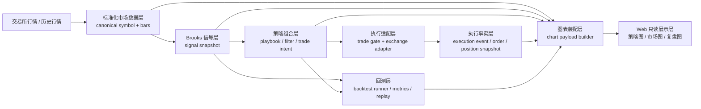

# AB Patrol 应有架构、当前偏差与重整顺序

> 更新于 2026-03-29
> 适用范围：`AB Patrol-Agent` + `AB Patrol-Web` + 当前 Brooks live / backtest / 图表主链

## 1. 这份文档解决什么问题

当前系统已经能跑，但你已经明显感觉到一个问题：

- 交易链能工作
- 图表也能工作
- 回测也还在
- 但是很多事实来源和展示口径没有完全分层

这会带来两个后果：

1. 有时系统真实在工作，但页面看起来像不工作
2. 有时页面能看到东西，但这些东西并不都来自同一份权威事实

这份文档只回答 3 个问题：

1. 对当前项目来说，应有架构应该是什么样
2. 当前项目和应有架构相比，偏差在哪里
3. 如果要重整，正确顺序应该是什么

---

## 2. 最终目标

本次重整以后，系统应当支持下面 4 个目标，而且是同一套底层事实支撑，不是互相分裂的多套链路：

### 2.1 图表可以自由查看，并且能接入更长历史

- 用户可以自由切品种、切周期、切交易所
- 图表能查看当前实时 K 线，也能继续往前加载历史数据
- 不要求每次打开页面都临时跑一遍策略，历史浏览和实时浏览应该复用同一套 bar 数据口径

### 2.2 Brooks 信号可以直接叠加在 K 线上

- `H1/H2/L1/L2`
- `ii / ioi / oo`
- `DT / DB / Wedge / MTR`
- `MAG / MM / Gap / 昨高昨低 / 今开`

这些信号必须是结构化对象，直接来自信号层，而不是页面临时猜。

### 2.3 策略研发应该建立在“信号 + 理论”之上

- 策略不是直接写死成一堆 if/else
- 而是由 Brooks 信号、背景、触发、保护、管理方式组合而成
- 这样后面才能讨论：
  - 哪些信号组合值得保留
  - 哪些背景下应该做 `stop`
  - 哪些背景下应该做 `limit`
  - 哪些 setup 只适合 scalp，不适合 swing

### 2.4 回测系统继续保留，并能和图表打通

- 回测不应成为一条旁路
- 回测与 live 应该共用同一套：
  - 信号定义
  - 策略对象
  - 图表可视化协议
- 图表里既能看实时事件，也能看回测事件

---

## 3. Brooks 约束

这份架构不是一般量化系统模板，而是必须服从 Brooks 交易体系。

### 3.1 订单类型不是交易所细节，而是价格行为语义

本地原文：

- [32C: PA determines order types; With and counter trend...md](/Users/mitchellcb/Desktop/Obsidian/Al-brooks-PA/AB Console-Obsidian/Categories 分类/Al brooks/价格行为学/32C PA determines order types; With and counter tr 22699d8757ab8155b4add4a2c56270d3.md)

我已经回看过对应图片页：

- `assets/32C PA determines order types; With and counter tr/image.png`

对应结论：

- 订单类型由价格行为决定
- 强趋势里更适合 `stop`
- 紧 TR 里多数情况不该用 stop 去追
- 宽 TR / 楔形 / 测试位里经常更适合 `limit`

因此系统里必须先有 `context + setup + trigger`，再决定订单类型，不能由前端或交易所适配层反推。

### 3.2 止损是交易对象的一部分，不是执行后补件

本地原文：

- [33A: Why use stops? Stop determines position size.md](/Users/mitchellcb/Desktop/Obsidian/Al-brooks-PA/AB Console-Obsidian/Categories 分类/Al brooks/价格行为学/33A Why use stops Stop determines position size 22699d8757ab81a8be93d03bd64ff72a.md)

我已经回看过对应图片页：

- `assets/33A Why use stops Stop determines position size/image 2.png`

对应结论：

- 先定 logical stop
- 再定 position size

因此系统里的 `trade_intent` 必须天然包含：

- 计划入场
- logical stop
- 目标
- 仓位大小来源

不能让执行层再临时补 stop。

### 3.3 Always In 只是背景，不等于自动下单

本地原文：

- [13B: Always in Long; Always in Short.md](/Users/mitchellcb/Desktop/Obsidian/Al-brooks-PA/AB Console-Obsidian/Categories 分类/Al brooks/价格行为学/13B Always in Long; Always in Short 22699d8757ab81079fbbd8331dca01b3.md)

我已经回看过对应图片页：

- `assets/13B Always in Long; Always in Short/image 15.png`

对应结论：

- reversal 常常还需要再多一根 bar
- follow-through 不够时，不能把背景当成触发

因此系统里必须把这 3 层分开：

- 背景
- setup
- trigger

不能把 `Always In`、`candidate`、`open order` 混成一个概念。

---

## 4. 应有架构图

### 4.1 总图

### 4.2 正确分层

#### 1. 标准化市场数据层

只负责两件事：

- 统一品种口径
- 提供权威 K 线

这里不做策略判断，不做下单。

#### 2. Brooks 信号层

把 K 线变成结构化信号，例如：

- `AIL / AIS / TR / TC / BC`
- `H1/H2/L1/L2`
- `ii / ioi / oo`
- `DT / DB / Wedge / MTR`
- `Gap / MAG / MM`

这里是“图表信号”和“策略信号”的共同来源。

#### 3. 策略组合层

把 Brooks 信号和理论知识组合成 `trade_intent`：

- 是否允许做
- 应该做 `stop` 还是 `limit`
- 计划入场、止损、目标
- 管理方式是 `scalp / swing / scale in / partial`

#### 4. 执行适配层

只解决交易所差异：

- Binance 条件单
- cTrader 原生保护单
- 最小名义价值
- 杠杆上限
- 订单确认方式

这里不应该决定“这是不是一个好 setup”。

#### 5. 执行事实层

统一存这些对象：

- `execution_event`
- `open_order_snapshot`
- `position_snapshot`
- `account_snapshot`

这是 Web 的订单页、账户页和管理视图的唯一事实来源。

#### 6. 图表装配层

图表不该再自己判断交易逻辑，而是只负责把同一轮事实画出来：

- `bars`
- `signal_snapshot`
- `trade_intent`
- `execution_event`
- `backtest_event`

#### 7. Web 只读展示层

Web 的职责只有：

- 查看
- 过滤
- 切换
- 对比
- 讨论

不再承担业务推断。

---

## 5. 应有的核心对象

### 5.1 `canonical_symbol`

内部唯一品种口径，例如：

- `BTCUSDT`
- `ETHUSDT`
- `EURUSD`
- `US500`

交易所专用格式，例如：

- `ETHUSDT:USDT`
- `BINANCE:ETHUSDT.P`

只允许在 adapter 或 widget 边界转换。

### 5.2 `bar_series`

字段至少包括：

- `symbol`
- `timeframe`
- `timestamp`
- `open/high/low/close`
- `volume`
- `source`

它是所有图表和信号的共同基础。

### 5.3 `signal_snapshot`

字段至少包括：

- 背景：`market_state / always_in / higher_tf_bias`
- 结构：`H/L / ii/ioi/oo / wedge / DB/DT / gap / MM`
- 质量：`signal_bar_quality / strength / risk_hint`
- 边界：`support / resistance / yesterday levels / EMA`

### 5.4 `trade_intent`

这是 live 和 backtest 共用的策略对象，字段至少包括：

- `symbol / timeframe / side`
- `setup_family`
- `order_type_semantic`
- `entry_price`
- `logical_stop`
- `profit_targets`
- `management_mode`
- `candidate_stage`
- `invalidations`

### 5.5 `execution_event`

字段至少包括：

- `exchange`
- `symbol`
- `event_type`
- `event_status`
- `order_id / client_id`
- `price / stop / tp`
- `exchange_confirmed`
- `message`

### 5.6 `position_snapshot`

字段至少包括：

- `symbol`
- `side`
- `entry`
- `stop`
- `tp`
- `size`
- `mark`
- `uPnL`
- `strategy_origin`

### 5.7 `chart_payload`

图表层只认统一协议：

- `candles`
- `markers`
- `price_lines`
- `overlay_lines`
- `signal_summary`
- `focus_meta`

### 5.8 `backtest_artifact`

字段至少包括：

- `strategy_id`
- `trade_intent`
- `fills`
- `equity_curve`
- `metrics`
- `chart_events`

---

## 6. 当前偏差

### 6.1 K 线与图表事实来源不够单一

当前虽然已经有 `trade_chart_data.py`，但图表仍偏向“按需生成”，而不是稳定读取一份标准 snapshot。

影响：

- 页面打开时更容易慢
- 图表有时像诊断工具，不像稳定终端
- 历史扩展和实时浏览更难统一

### 6.2 符号口径还会泄漏到上层

最近已经暴露出典型问题：

- 持仓里出现 `ETHUSDT:USDT`
- 页面切图、账户匹配、图表请求用的是 `ETHUSDT`

影响：

- 图表可能请求到错误账户
- 同一笔仓位在不同页面显示成两个“不同品种”

### 6.3 Web 还在做部分业务判断

现在 Web 并不只是展示：

- 它还在拼历史
- 还在做 fallback
- 还在根据不同对象猜当前应该显示哪张图

影响：

- 页面越做越重
- 业务口径更难验证

### 6.4 交易对象还没有完全统一

当前系统里已经有：

- `currentActions`
- `historicalOrders`
- `positions`
- `managementActions`

但 `signal_snapshot`、`trade_intent`、`execution_event` 的边界还不够清楚。

影响：

- 很多页面能看到信息，但不容易一眼区分：
  - 这是背景
  - 这是候选
  - 这是计划单
  - 这是成交事实

### 6.5 回测和 live 还是“共引擎、弱同构”

当前文档已经说明 live 与 backtest 共用信号引擎，但图表装配、事件协议、策略对象还没有做到真正同构。

影响：

- 回测里看见的东西，不一定能原样映射到 live 图里
- 后续做“信号组合策略研发”时，来回对齐成本会高

### 6.6 执行适配层的交易所差异会向上泄漏

Binance Demo 的条件单就是例子：

- 本质是 adapter 差异
- 但之前已经影响到上层状态判断和页面理解

影响：

- 用户会误以为“策略没工作”
- 实际只是“交易所确认方式不同”

### 6.7 图表还没有成为真正的研究工作台

你最终想要的是：

- 自由看图
- 自由叠加信号
- 边看边讨论
- 后面直接在信号层组合策略

但当前图表更多还是：

- 事件查看器
- 页面诊断器

还不是完整研究工作台。

---

## 7. 重整顺序

这里不按“大版本重写”思路做，而按可连续迁移的顺序做。

### 第一步：冻结对象定义，不再继续加页面逻辑

先把下面 6 个对象定义为权威协议：

- `canonical_symbol`
- `bar_series`
- `signal_snapshot`
- `trade_intent`
- `execution_event`
- `position_snapshot`

在这一步完成前，不建议继续扩页面功能。

### 第二步：统一品种口径

目标：

- 内部只保留一种 canonical symbol
- 所有交易所别名都只在 adapter 层转换

优先处理：

- Binance `ETHUSDT:USDT` 这类符号
- TradingView 显示符号
- Web 图表、订单、总览、账户页的品种匹配

### 第三步：建立单一 bar 数据层

目标：

- 同品种同周期只认一份权威 K 线
- 图表、信号、回测都从这里读

这一步要解决：

- 实时数据和历史补数的拼接
- 历史扩容
- 周期切换
- 不同交易所 K 线差异

### 第四步：把 Brooks 信号层独立出来

目标：

- 图表信号和策略信号共用同一份 `signal_snapshot`

应当明确拆出：

- 背景信号
- setup 信号
- trigger 信号
- 管理信号

后面讨论策略时，直接拿这层组合，不再到页面里肉眼找。

### 第五步：统一 `trade_intent`

目标：

- live 和 backtest 都先产出 `trade_intent`
- 执行层只消费 `trade_intent`

这一步完成后，系统才能稳定回答：

- 为什么这笔单该做
- 为什么该用 `stop` 或 `limit`
- 为什么止损在这里
- 为什么目标在这里

### 第六步：把执行层压回 adapter 边界

目标：

- 交易所差异只在 execution-service 内部处理
- 上层只看统一的执行事实

包括：

- 条件单确认
- 订单查询
- 保护单类型
- 杠杆设置
- 最小名义价值

### 第七步：重做图表装配层

目标：

- 图表不再现算业务逻辑
- 图表只消费标准对象

图表 payload 应该只来自：

- `bar_series`
- `signal_snapshot`
- `trade_intent`
- `execution_event`
- `backtest_event`

### 第八步：把回测正式接到同一协议

目标：

- 回测输出和 live 输出能落到同一张图上
- 图表里既能看：
  - 策略信号
  - 回测进出
  - live 真实订单

这一步完成后，策略研发效率会明显提升。

### 第九步：最后再做研究工作台和页面布局

等前面 8 步稳定以后，再做这些：

- 自由浏览历史
- 多图同步
- 信号分组筛选
- 信号树
- 策略组合面板
- tradecat 风格布局强化

这样页面才不是漂亮但脆弱。

---

## 8. 建议的最终产品形态

### 8.1 图表中心

主工作台应当是图表，而不是订单表。

最少包括 4 个标签：

- `实时策略图`
- `市场图`
- `回测复盘图`
- `信号研究图`

### 8.2 图表中心的左侧

显示：

- 品种
- 周期
- 交易所
- 历史加载范围
- 信号组开关

### 8.3 图表中心的右侧

显示：

- 背景
- 当前信号
- 当前 `trade_intent`
- 保护位
- 管理计划
- 最近执行事件

### 8.4 图表下方

显示：

- 回测事件轴
- live 执行轴
- 讨论记录或批注

这才符合你想要的“看图、讨论、组合策略、接回测”的最终方向。

---

## 9. 当前不建议继续做的事

在完成重整前，不建议继续把主要精力放在下面这些地方：

- 再扩更多页面卡片
- 再补一批零散信号按钮
- 再做更多临时 fallback 聚合
- 在 Web 里继续推导业务状态
- 继续把交易所差异暴露到上层

这些工作不是没价值，而是顺序应该更靠后。

---

## 10. 一句话结论

当前系统的问题，不是 Brooks 理论错了，也不是主链完全错了。

真正的问题是：

- 数据层
- 信号层
- 策略层
- 执行层
- 展示层

还没有做到各自只做自己的事。

如果接下来按这份顺序重整，最终就能得到你想要的系统：

- 图表自由查看并带历史
- Brooks 信号稳定叠加
- 后续按信号和理论组合策略
- 回测继续保留，并直接接入图表工作台
