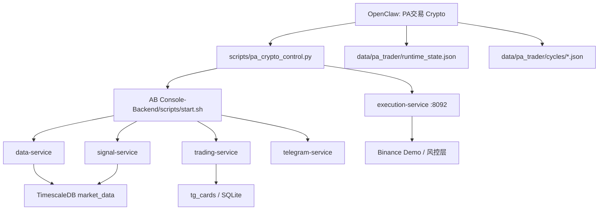

# 当前系统总览（2026-03-07）

## 1. 当前目录结构

```text
Al-brooks-PA/
├── AB Console-Backend/
│   ├── config/                       # 统一配置（生产 .env 只读）
│   ├── data/pa_trader/               # PA 历史运行快照、cycle、state
│   ├── libs/                         # 共享库、数据库 schema、SQLite
│   ├── scripts/                      # 运维脚本、交易控制脚本
│   ├── services/
│   │   ├── ai-service/               # AI 分析子模块（依附 telegram-service）
│   │   ├── data-service/             # 1m K线 / 5m 期货指标采集
│   │   ├── execution-service/        # 交易执行与风控 API（8092）
│   │   ├── signal-service/           # PG / SQLite 信号检测
│   │   ├── telegram-service/         # 仓库内 Telegram bot
│   │   └── trading-service/          # 指标计算 / tg_cards 写入
│   └── web/                          # Next.js Dashboard
├── docs/                             # 项目级文档
├── 📁 启动工具/                       # Finder 双击启动工具
└── ~/.openclaw/                      # OpenClaw gateway、agent、workspace
```

## 2. 当前 OpenClaw / TG 映射

| 话题 | TG 话题链接 | Agent | 作用 |
| --- | --- | --- | --- |
| 涟漪 | `https://t.me/c/3512657369/2` | `ripple` | 个人助理 |
| PA交易 Crypto | `https://t.me/c/3512657369/3` | `ab-patrol-runtime` | 加密交易操作入口 |
| 系统维护 | `https://t.me/c/3512657369/4` | `system-maintenance` | 项目系统维护 |

说明：

- `PA交易 Crypto` 是 OpenClaw agent 名。
- 实际 execution-service 里沿用的交易 bot id 仍然是 `claude-pa`。
- 当前映射关系是：`ab-patrol-runtime`（对话层） -> `claude-pa`（交易执行层）。

## 3. 当前功能表

| 模块 | 当前职责 | 输入 | 输出 |
| --- | --- | --- | --- |
| data-service | 采集 1m K线、5m 期货指标、做缺口补齐 | Binance WebSocket / REST | TimescaleDB `market_data.*` |
| trading-service | 轮询高优先级币种，计算技术指标 | TimescaleDB | `tg_cards.*`、日志 |
| signal-service | 检查 PG / SQLite 信号规则 | TimescaleDB / SQLite | 信号事件、历史记录 |
| execution-service | 下单、持仓、风控、bot allocation | Binance demo / 本地风控配置 | HTTP API |
| telegram-service | 仓库内 Telegram bot、卡片和命令 | SQLite / PG / HTTP API | TG 消息 |
| OpenClaw `ab-patrol-runtime` | TG 对话入口，控制后台、读状态、解释市场 | OpenClaw OAuth + 本地脚本 | TG 对话 |
| `AB Patrol-Agent` | Al Brooks patrol 决策层，读取原 `SKILL.md + S0-S7` 做单轮交易判断 | OpenClaw `ab-patrol-loop` + execution 快照 + 市场快照 | cycle / runtime_state / TG 状态卡 |
| `pa_crypto_control.py` | `PA交易 Crypto` 统一控制和状态卡入口 | 本地进程 / execution API / runtime state | TG 纯文本状态卡 |

## 4. 当前交易执行逻辑



### 4.1 启动链

1. `PA交易 Crypto` 在 TG 中接收“启动后端 / 状态 / 停止后端”等指令。
2. Agent 运行 `AB Console-Backend/scripts/pa_crypto_control.py`。
3. 该脚本负责：
   - 拉起 `TimescaleDB`
   - 拉起核心后端 `data/trading/signal/telegram`
   - 拉起 `execution-service`
   - 汇总 execution API、runtime state、cycle 文件，输出状态卡

### 4.1.1 当前可用控制命令

- `start`：启动交易后端
- `stop`：停止交易后端
- `restart`：重启交易后端
- `status`：输出当前状态卡
- `card`：输出与 `status` 同格式的 TG 卡片
- `paths`：输出关键路径，便于排障

### 4.2 交易决策链

1. `data-service` 写入最新 K线和期货指标到 TimescaleDB。
2. `trading-service` 基于高优先级币种计算指标，写入 `tg_cards.*`。
3. `signal-service` 基于 PG / SQLite 检测信号。
4. `AB Patrol-Agent` 读取原 `patrol-l1` skill、S 文件、execution 快照、市场快照，调用 `ab-patrol-loop` 产出单轮决策。
5. `ab-patrol-runtime` 在 TG 中读取 cycle / runtime state / execution 状态做解释与控制。
6. 真正下单时仍通过 `execution-service`，并复用 `claude-pa` allocation。

### 4.3 当前关键事实

- `can_trade` 当前以 execution-service 实时接口为准。
- `runtime_state.json` 是当前 patrol loop 的显式状态文件；如果 loop 进程停止，它会变成旧快照。
- 所以当前是否是“自动巡逻闭环”，要以 `AB Patrol-Agent` 的 loop 进程是否在跑为准，不能只看文件在不在。

## 5. 当前已知问题与状态

### 5.1 已清理 / 已修复

- `signal_state.*` schema 已补齐。
- `signal-service` 启动链已恢复。
- `trading-service` 缺失的 `_last` 兼容视图已落库，启动日志不再继续报 `relation does not exist`。
- `signal-service` 的陈旧输入告警已改成聚合摘要，不再对每个币种刷一行。
- `PA交易 Crypto` 现在可以作为 TG 中的统一控制入口，并输出统一状态卡。

### 5.2 当前外部限制

- `data-service` 的 1m K线补齐会遇到 Binance `451 restricted location`。
- 当前 `data-service` 进程环境里的 `HTTP_PROXY` / `HTTPS_PROXY` 为空。
- 这会导致：
  - `ws` 断流后，REST fallback 补齐失败
  - `signal-service` 周期性看到 `candles_1m` 陈旧
  - patrol 历史快照里的 `runtime_trade_readiness` 仍可能显示旧值

### 5.3 当前运行语义

- 后端服务可以启动、停止、查询状态。
- execution-service 真实在线，可返回 `can_trade`、`available_margin`、`positions` 等。
- `PA交易 Crypto` 的 TG 输出将以状态卡为主，而不是自由发挥的长段文本。

## 6. 关键文件

| 路径 | 用途 |
| --- | --- |
| `/Users/mitchellcb/Desktop/Obsidian/Al-brooks-PA/AB Console-Backend/scripts/pa_crypto_control.py` | `PA交易 Crypto` 统一控制入口 |
| `/Users/mitchellcb/Desktop/Obsidian/Al-brooks-PA/AB Console-Backend/data/pa_trader/state/runtime_state.json` | 历史 runtime 快照 |
| `/Users/mitchellcb/Desktop/Obsidian/Al-brooks-PA/AB Console-Backend/data/pa_trader/cycles/` | 历史分析 cycle |
| `/Users/mitchellcb/Desktop/Obsidian/Al-brooks-PA/AB Console-Backend/services/data-service/logs/ws.log` | 行情断流 / 451 诊断 |
| `/Users/mitchellcb/Desktop/Obsidian/Al-brooks-PA/AB Console-Backend/services/trading-service/logs/service.log` | 指标计算日志 |
| `/Users/mitchellcb/Desktop/Obsidian/Al-brooks-PA/AB Console-Backend/services/signal-service/logs/signal-service.log` | 信号引擎日志 |
| `/Users/mitchellcb/Desktop/Obsidian/Al-brooks-PA/AB Console-Backend/services/execution-service/logs/execution.log` | 交易执行日志 |
