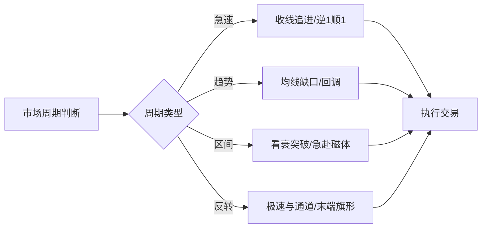

# Brooks Playbook

> [!info] 兼容说明
> 本页是当前系统的 **Brooks Playbook 索引入口**。为保证历史链接、脚本入口与图片路径不失效，文件路径与部分历史表述暂时保留（原“太妃方案”）。

> [!info] 策略体系概览
> 本 Playbook 汇总了 11 个核心策略，并对齐到 Al Brooks 标准术语，便于与经典价格行为理论对照学习。

## 📚 策略索引

| 策略名称     | Al Brooks 术语    | 市场周期 | 盈亏比    | 详细链接                  |
| ------------ | ----------------- | -------- | --------- | ------------------------- |
| 收线追进     | Buy/Sell NOW      | 急速     | 1.5:1-2:1 | [[策略卡片_收线追进]]     |
| 高 1/低 1    | High 1/Low 1      | 趋势延续 | 2:1-3:1   | [[策略卡片_逆1顺1]]       |
| 区间突破回调 | Breakout Pullback | 突破模式 | 2:1-3:1   | [[策略卡片_区间突破回调]] |
| 20 均线缺口  | 20 EMA Gap        | 趋势回调 | 2:1-3:1   | [[策略卡片_20均线缺口]]   |
| 第一均线缺口 | First MA Gap      | 趋势回调 | 2.5:1-3:1 | [[策略卡片_第一均线缺口]] |
| 双重顶底     | Double Top/Bottom | 区间反转 | 1.5:1-2:1 | [[策略卡片_双重顶底]]     |
| 楔形顶底     | Wedge Top/Bottom  | 反转     | 2:1+      | [[策略卡片_楔形顶底]]     |
| 看衰突破     | Fade Breakout     | 交易区间 | 1.5:1-2:1 | [[策略卡片_看衰突破]]     |
| 急赴磁体     | Rush to Magnet    | 交易区间 | 1:1-1.5:1 | [[策略卡片_急赴磁体]]     |
| 极速与通道   | Spike and Channel | 反转     | 2:1+      | [[策略卡片_极速与通道]]   |
| 末端旗形     | Final Flag        | 反转     | 2:1+      | [[策略卡片_末端旗形]]     |

---

## 急速方案

**核心策略**: [[策略卡片_收线追进]], [[策略卡片_逆1顺1]]（高 1/低 1）

**适用周期**: 突破/急速行情  
**关键特征**: 强势 K 线连续突破,动能强劲  
**入场时机**: 市价追进或逆 1 顺 1 回调入场

- 突破跟随
- - 
- - 

---

## 回調方案

**核心策略**: [[策略卡片_双重顶底]], [[策略卡片_楔形顶底]], [[策略卡片_20均线缺口]], [[策略卡片_第一均线缺口]]

**适用周期**: 趋势中的回调/反转  
**关键特征**: 两次或三次测试极值,动能递减  
**入场时机**: 双重顶底、三推楔形反转信号

---

## 區間方案

**核心策略**: [[策略卡片_看衰突破]], [[策略卡片_急赴磁体]], [[策略卡片_区间突破回调]]

**适用周期**: 交易区间/盘整  
**关键特征**: 价格在上下边界之间震荡  
**入场时机**: 区间边界做突破失败,或接近边界(≤25%)做剥头皮

- 看衰突破/急赴磁体/突破回调
- - 
- - 
- - 
- - 
- - 

---

## 反轉方案

**核心策略**: [[策略卡片_极速与通道]], [[策略卡片_末端旗形]]

**适用周期**: 趋势末期  
**关键特征**: 动能衰竭,磁体阻挡  
**入场时机**: 通道起点、末端旗形突破失败

- 大型趋势反转的四大要件
- 看衰突破/急赴磁体/突破回调
- - 
- - 
- - 
- - 

## 反轉方案

- 大型趋势反转的四大要件
  - 1.  逆向压力积累
  - 2.  趋势线突破
  - 3.  极值不再递进
  - 4.  原趋势极值测试被否决

---

## 均線方案

**核心策略**: [[策略卡片_20均线缺口]], [[策略卡片_第一均线缺口]]

## **适用周期**: 趋势回调

## 🎯 使用建议

1. **新手交易者**:

   - 从区间方案开始(看衰突破、急赴磁体)
   - 只交易高概率设置
   - 严格执行止损

2. **中级交易者**:

   - 加入趋势回调策略(20 均线缺口、逆 1 顺 1)
   - 学习判断市场周期
   - 提高入场时机把握

3. **高级交易者**:
   - 掌握反转策略(极速与通道、末端旗形)
   - 结合多个策略综合判断
   - 根据脉络灵活调整

## 📖 学习路径

---

## 案例图库

### 综合案例

- - 

- 20 均线缺口./Categories%20 分类/太妃价格行为/assets/太妃/img_1681793434444943580.jpg)
- - 
- - 
- 末端旗形
- - 
- - 

## 均線方案

- 20 均线缺口
- - 
- - 
- - 

## 案例

- - 
- - 
- - 
- - 
- - 
