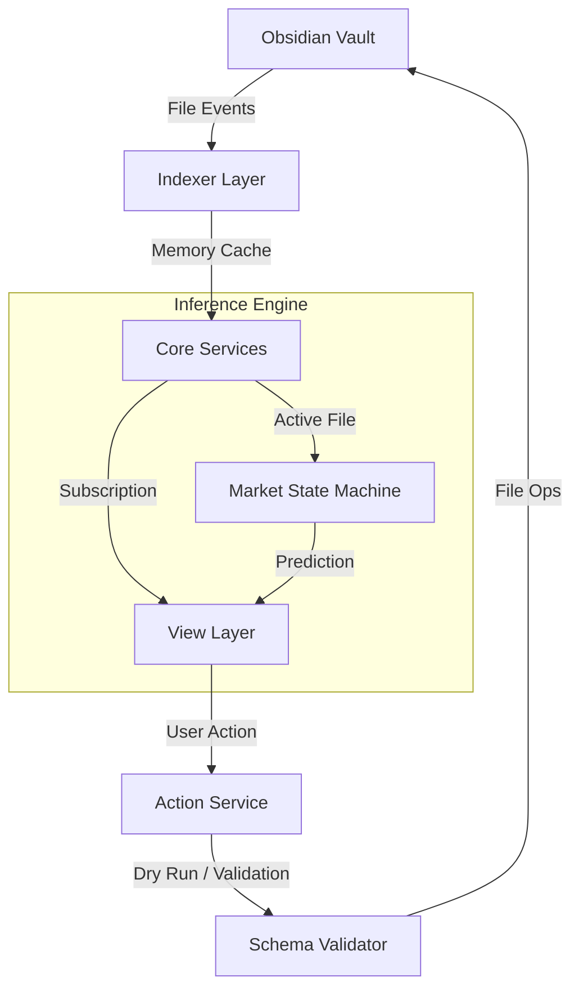

# 📊 插件控制台数据逻辑架构文档

> **文档类型**: 核心技术文档  
> **版本**: v1.1.0  
> **创建**: 2026-01-11  
> **更新**: 2026-01-16  
> **维护**: Antigravity Agent  
> **重要性**: ⭐⭐⭐⭐⭐ 核心架构文档

---

## 📖 文档说明

本文档详细描述了 Al Brooks Trader Console 插件的**完整数据逻辑架构**，包括：
- **读取流 (Read Path)**: 索引构建、数据在组件间的流动。
- **写入流 (Write Path)**: ActionService 的统一写入、Dry Run 机制。
- **推演流 (Inference Path)**: 市场状态机与策略匹配。

---

## 🏗️ 一、系统架构总览

### 1.1 双向数据流 (Read/Write)

### 1.2 核心设计原则

1.  **确定性逻辑 (Deterministic Logic)**: 拒绝 AI 猜测，严格基于 Frontmatter 字段。
2.  **单一数据源**: Obsidian Vault 是唯一真理来源。索引层只是 Vault 的“投影”。
3.  **读写分离**: 
    *   **读**: 通过 `TradeIndex` (高速内存索引)。
    *   **写**: 通过 `ActionService` (原子化文件操作，支持 Undo)。

---

## 📂 二、写入层 (Write Layer - ActionService)

### 2.1 架构设计
`ActionService` 是所有修改操作的**唯一入口**。直接调用 Obsidian API 修改文件是被**严格禁止**的（除了 ActionService 内部）。

**核心能力**:
*   **updateTrade(path, changes)**: 更新交易笔记 Frontmatter。
*   **createTrade()**: 创建新交易。
*   **Batch Operations**: 批量更新（开发中）。

### 2.2 安全机制
1.  **Dry Run (预演)**: 在实际写入前，先模拟修改，返回 `diff` 供用户确认（或UI显示）。
2.  **Schema Validation**: 写入前校验字段类型、枚举值合法性。如果不合法，拒绝写入。
3.  **Atomic Write**: 使用 Obsidian `processFrontmatter` 确保并发安全。

---

## 🧮 三、推演层 (Inference Layer)

### 3.1 Market State Machine (市场状态机)
负责根据当前笔记的 `marketCycle` 和 `direction` 推演下一步。

**输入**:
*   `Active Metadata` (来自当前交易笔记)
*   `Latest Trade` (历史辅助，仅在 Explicit Request 时使用)

**输出**:
*   `State`: e.g., "Strong Bull Trend"
*   `Guidance`: e.g., "Look for H1/H2 entries"

**上下文隔离 (Strict Context)**:
*   状态机**优先**相信当前文件的 Frontmatter。
*   如果当前文件未定义，显示 "Waiting for Context"，**绝不**自动回退到上一笔交易，防止误导。

### 3.2 Strategy Matcher V2 (策略评分)
负责计算当前行情与策略的匹配度。

**评分维度**:
1.  **Setup**: 20分 (e.g., "H1", "Wedge")
2.  **Signal**: 30分 (e.g., "Good Signal Bar")
3.  **Context**: 50分 (e.g., "Trend Confirmation")

总分 > 60 分确认为 "Potential Setup"。

---

## 🗂️ 四、索引层 (Indexer Layer)

（保持 v1.0.0 内容，此处省略重复部分，重点强调更新点）

**更新点**:
*   **Sticky Awareness**: 索引层增加了对 `active-leaf-change` 的特殊处理，支持视图层实现“粘性上下文”。

---

## 🎨 五、视图层 (View Layer)

### 5.1 Trading Hub (交易中心)
*   **数据源**: 混合数据源。
    *   **历史数据**: 来自 `TradeIndex`。
    *   **实时预测**: 来自 `MarketStateMachine` (基于 `activeMetadata`)。
*   **交互**: 
    *   用户点击 "Open Long" -> 触发 `ActionService.createTrade()`。
    *   用户修改 "Cycle" -> 触发 `metadata` 变化 -> 触发 `ReviewHints` 重算。

---

## 🔄 六、更新日志

### v1.1.0 (2026-01-16)
*   ✨ 新增: `ActionService` 写入层架构描述。
*   ✨ 新增: `Inference Layer` (推演层) 市场状态机逻辑。
*   🔧 优化: 明确了读写分离的原则。

---

**维护**: Antigravity Agent
