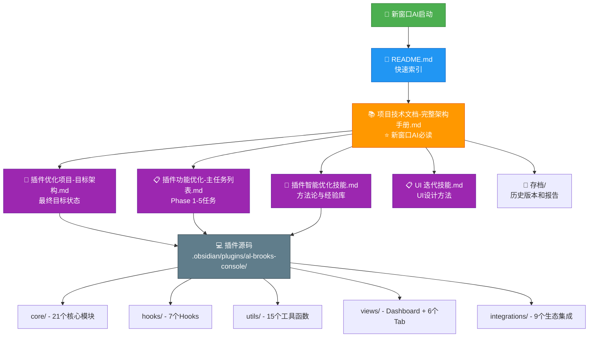

# 📊 交易员控制台 - 文档关系图



## 文档层级结构

```
🦁 交易员控制台 (Trader Command)/
│
├── 📄 README.md ⭐ 快速索引入口
│   └─→ 指向所有核心文档
│
├── 📚 项目技术文档-完整架构手册.md ⭐⭐⭐⭐⭐ 新窗口AI必读
│   ├─ 完整代码库清单 (93个源文件)
│   ├─ 开发路线图与任务状态
│   ├─ 代码质量指标
│   ├─ 技术债务清单
│   └─ 决策建议
│
├── 🎯 插件优化项目-目标架构.md ⭐⭐⭐⭐⭐
│   ├─ 目标文件结构
│   ├─ UI设计规范
│   ├─ 模块职责划分
│   └─ 验收标准
│
├── 📋 插件功能优化-主任务列表.md ⭐⭐⭐⭐⭐
│   ├─ 核心执行铁律
│   ├─ Phase 1: 核心架构与全局优化
│   ├─ Phase 2: 交易大厅
│   ├─ Phase 3: 数据中心
│   ├─ Phase 4: 学习模块
│   └─ Phase 5: 管理中心
│
├── 🧠 插件智能优化技能.md ⭐⭐⭐⭐
│   ├─ 工具生态 (sequential-thinking, serena, context7...)
│   ├─ 标准优化流程 (9步)
│   ├─ 成功经验 (10条)
│   └─ 失败教训 (5条)
│
├── 📋 UI 迭代技能（插件控制台）.md ⭐⭐⭐
│   └─ UI设计和迭代方法
│
└── 📂 存档/
    ├─ 📋 插件优化项目-主任务列表-20260110-UI阶段.md
    ├─ 📊 Phase 6完成-项目结构检查报告.md
    ├─ 🐛 属性管理器Bug修复报告_2026-01-09.md
    └─ 📝 系统升级日志.md
```

## 使用指南

### 场景1: 新窗口AI启动

```
1. 打开 README.md
2. 阅读 📚 项目技术文档-完整架构手册.md
3. 5分钟内恢复完整上下文
```

### 场景2: 开始新任务

```
1. 查看 📋 插件功能优化-主任务列表.md 确定当前Phase
2. 参考 🎯 插件优化项目-目标架构.md 确认目标
3. 遵循 🧠 插件智能优化技能.md 的标准流程
```

### 场景3: 遇到问题

```
1. 查看 🧠 插件智能优化技能.md 的失败教训
2. 参考成功经验寻找解决方案
3. 更新经验库
```

### 场景4: 查看历史

```
1. 进入 📂 存档/ 文件夹
2. 查看相关历史报告
```

## 文档更新策略

| 文档 | 更新频率 | 触发条件 |
|------|----------|----------|
| README.md | 低频 | 文档结构变化 |
| 项目技术文档 | 中频 | 代码库重大变化、新阶段开始 |
| 目标架构 | 低频 | 目标调整 |
| 主任务列表 | 高频 | 任务进度更新 |
| 优化技能 | 中频 | 新经验积累 |

## 关联关系

```
项目技术文档 (中心枢纽)
    ↓
    ├─→ 引用 目标架构 (目标定义)
    ├─→ 引用 主任务列表 (任务分解)
    ├─→ 引用 优化技能 (方法论)
    └─→ 引用 存档 (历史记录)

主任务列表
    ↓
    ├─→ 引用 目标架构 (验收标准)
    └─→ 引用 优化技能 (执行方法)

目标架构
    ↓
    └─→ 引用 主任务列表 (实施路径)
```

---

**维护**: 本图表应随文档体系演进而更新  
**最后更新**: 2026-01-11
