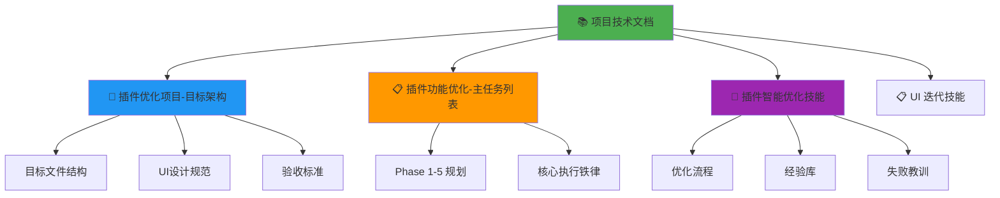

# 📚 Al Brooks Trader Console - 项目技术文档

> **文档类型**: 维护技术手册  
> **版本**: v2.0.0  
> **最后更新**: 2026-01-11  
> **维护者**: Antigravity Agent  
> **状态**: 🟢 活跃维护中

---

## 📖 文档导航

### 核心文档关联图



### 文档索引

| 文档名称 | 用途 | 链接 |
|---------|------|------|
| **本文档** | 项目全局技术手册，快速上下文恢复 | 当前文件 |
| **数据逻辑架构** | 完整数据流与处理逻辑 | [📊 数据逻辑架构文档](./📊%20数据逻辑架构文档.md) |
| **数据管理升级** | Phase 1详细设计方案（7周路线图） | [🔄 数据管理架构升级方案](./🔄%20数据管理架构升级方案.md) |
| **目标架构** | 定义最终目标状态和验收标准 | [🎯 插件优化项目-目标架构](./🎯%20插件优化项目-目标架构.md) |
| **主任务列表** | Phase 1-5 的详细任务分解 | [📋 插件功能优化-主任务列表](./📋%20插件功能优化-主任务列表.md) |
| **优化技能** | 优化方法论和经验库 | [🧠 插件智能优化技能](./🧠%20插件智能优化技能.md) |
| **UI迭代技能** | UI设计和迭代方法 | [📋 UI 迭代技能](./📋%20UI%20迭代技能（插件控制台）.md) |
| **存档文件夹** | 历史版本和报告 | [./存档/](./存档/) |

---

## 🏗️ 一、项目架构总览

### 1.1 项目基本信息

**项目名称**: Al Brooks Trader Console  
**插件版本**: v1.0.0 (LTS) → v2.0.0 (开发中)  
**技术栈**: TypeScript 4.7.4 + React 18.2.0 + esbuild  
**Obsidian最低版本**: 0.15.0  
**代码仓库**: `.obsidian/plugins/al-brooks-console/`

### 1.2 核心目录结构

```
al-brooks-console/
├── src/
│   ├── core/              # 21个核心业务模块
│   ├── hooks/             # 7个自定义Hooks
│   ├── utils/             # 15个工具函数
│   ├── ui/                # 9个UI组件 + 样式系统
│   ├── views/             # Dashboard + 6个Tab + 子组件
│   ├── platforms/         # Obsidian平台适配层
│   ├── integrations/      # 9个外部插件集成
│   ├── types/             # TypeScript类型定义
│   └── main.ts            # 插件入口
├── manifest.json          # 插件清单
├── versions.json          # 版本兼容性
├── package.json           # 依赖管理
├── tsconfig.json          # TypeScript配置
└── esbuild.config.mjs     # 构建配置
```

### 1.3 架构演进路径

```
v1.0.0 (当前LTS)          v2.0.0 (目标架构)
┌─────────────────┐       ┌─────────────────┐
│ Dashboard.tsx   │       │ Dashboard.tsx   │
│   7,624 行      │  -->  │   ~2,000 行     │
│                 │       │                 │
│ 所有功能混在    │       │ 只保留:         │
│ 一个文件中      │       │ - Tab切换       │
│                 │       │ - 全局状态      │
│                 │       │ - 布局路由      │
└─────────────────┘       └─────────────────┘
                                  │
                    ┌─────────────┼─────────────┐
                    │             │             │
              ┌─────▼────┐  ┌────▼─────┐  ┌───▼──────┐
              │ utils/   │  │ hooks/   │  │ tabs/    │
              │ ~1,000行 │  │ ~800行   │  │ 4×500行  │
              └──────────┘  └──────────┘  └──────────┘
```

**当前进度**: 
- ✅ utils/ 已完成 (15个文件)
- ✅ hooks/ 已完成 (7个文件)
- 🟡 ui/components/ 部分完成 (9个文件)
- ⏸️ tabs/ 拆分暂停 (高耦合度)
- ⏳ Phase 1-5 功能未启动

---

## 📊 二、代码库详细清单

### 2.1 核心业务模块 (core/) - 21个文件

| 模块名 | 文件 | 功能描述 | 依赖关系 |
|--------|------|----------|----------|
| **索引系统** | `trade-index.ts` | 交易笔记索引 | → platforms/obsidian |
| | `strategy-index.ts` | 策略卡片索引 | → platforms/obsidian |
| | `indexer.ts` | 索引器基类 | 被上述两者继承 |
| **分析引擎** | `analytics.ts` | 数据分析核心 | → trade-index |
| | `hub-analytics.ts` | 交易中心分析 | → analytics |
| | `stats.ts` | 统计模块 | → analytics |
| **策略系统** | `strategy-matcher.ts` | 策略匹配引擎 | → strategy-index |
| **学习系统** | `coach.ts` | 教练建议 | → trade-index, analytics |
| | `course.ts` | 课程模块 | → coach |
| | `sm2.ts` | SM2间隔重复算法 | → course |
| | `memory.ts` | 记忆系统 | → sm2 |
| **管理系统** | `manager.ts` | 管理器核心 | → inspector |
| | `inspector.ts` | 数据检查器 | → trade-index |
| | `manager-groups.ts` | 管理器分组 | → manager |
| | `review-hints.ts` | 复习提示 | → manager |
| **工具模块** | `today-context.ts` | 今日上下文 | → platforms/obsidian |
| | `field-mapper.ts` | 字段映射器 | 独立 |
| | `cover-parser.ts` | 封面解析器 | 独立 |
| | `enum-presets.ts` | 枚举预设值 | 独立 |
| | `export-snapshot.ts` | 数据导出快照 | → analytics |
| | `console-state.ts` | 控制台状态管理 | 全局 |
| | `contracts.ts` | 类型契约定义 | 全局 |

### 2.2 自定义Hooks (hooks/) - 7个文件

| Hook名称 | 用途 | 返回值 | 使用位置 |
|----------|------|--------|----------|
| `useDashboardData.ts` | 加载所有Dashboard数据 | `{ trades, strategies, loading }` | Dashboard.tsx |
| `useAnalyticsState.ts` | 分析数据状态管理 | `{ filters, setFilters, ... }` | AnalyticsTab.tsx |
| `useLearnData.ts` | 学习模块数据 | `{ coachFocus, courses, ... }` | LearnTab.tsx |
| `useManagerState.ts` | 管理器状态 | `{ healthStatus, issues, ... }` | ManageTab.tsx |
| `useSchemaState.ts` | Schema状态 | `{ schemaIssues, ... }` | ManageTab.tsx |

### 2.3 工具函数 (utils/) - 15个文件

| 分类 | 文件名 | 核心函数 | 用途 |
|------|--------|----------|------|
| **格式化** | `format-utils.ts` | `formatCurrency()`, `formatPercent()` | 数字、货币、百分比格式化 |
| **日期** | `calendar-utils.ts` | `generateHeatmapData()` | 日历热力图数据生成 |
| **搜索** | `search-utils.ts` | `filterStrategies()`, `searchTrades()` | 策略搜索与过滤 |
| **聚合** | `aggregation-utils.ts` | `groupByDate()`, `calculateStats()` | 数据聚合计算 |
| **图表** | `chart-utils.ts` | `prepareChartData()` | 图表数据处理 |
| **字符串** | `string-utils.ts` | `truncate()`, `slugify()` | 字符串处理 |
| **策略** | `strategy-utils.ts` | `matchStrategy()` | 策略相关工具 |
| **数据计算** | `data-calculation-utils.ts` | `calculateWinRate()` | 交易数据计算 |
| **颜色** | `color-utils.ts` | `getOutcomeColor()` | 颜色工具 |
| **画廊** | `gallery-utils.ts` | `generateGalleryItems()` | 画廊工具 |
| **验证** | `validation-utils.ts` | `validateTrade()` | 数据验证 |

### 2.4 UI组件系统 (ui/)

#### 通用组件 (ui/components/) - 9个

| 组件名 | 用途 | Props | 复用度 |
|--------|------|-------|--------|
| `Button.tsx` | 统一按钮组件 | `variant`, `size`, `onClick` | ⭐⭐⭐⭐⭐ |
| `Card.tsx` | 卡片容器 | `title`, `children` | ⭐⭐⭐⭐⭐ |
| `GlassPanel.tsx` | 玻璃态面板 | `children`, `style` | ⭐⭐⭐⭐ |
| `SectionHeader.tsx` | 区块标题 | `title`, `subtitle` | ⭐⭐⭐⭐ |
| `EmptyState.tsx` | 空状态组件 | `message`, `icon` | ⭐⭐⭐ |
| `MarkdownBlock.tsx` | Markdown渲染 | `content` | ⭐⭐⭐ |
| `InteractiveButton.tsx` | 交互按钮 | `onClick`, `loading` | ⭐⭐ |
| `ConsoleErrorBoundary.tsx` | 错误边界 | `children` | ⭐ (全局) |
| `DesignSystem.tsx` | 设计系统 | - | ⭐ (全局) |

#### 样式系统 (ui/styles/)

| 文件 | 用途 |
|------|------|
| `theme.ts` | 主题变量定义 |
| `glass.ts` | Glassmorphism样式 |
| `dashboardPrimitives.ts` | Dashboard原子样式 |
| `tokens.ts` | 设计令牌 |

### 2.5 视图层 (views/)

#### 主控制器

**Dashboard.tsx** (当前 ~7,000行 → 目标 ~2,000行)
- **职责**: Tab切换、全局状态管理、布局路由
- **不应包含**: 具体业务逻辑、数据计算、UI渲染细节

#### Tab组件 (views/tabs/) - 6个

| Tab名称 | 文件 | 当前行数 | 目标行数 | 耦合度 | 状态 |
|---------|------|----------|----------|--------|------|
| Trading Hub | `TradingHubTab.tsx` | 836 | ~500 | 🟡 中 | ✅ 已拆分 |
| Analytics | `AnalyticsTab.tsx` | 1,362 | ~500 | 🔴 高 | ⏸️ 暂停 |
| Journal | `JournalTab.tsx` | - | ~500 | - | 📝 规划中 |
| Learn | `LearnTab.tsx` | 1,170 | ~500 | 🟡 中 | ✅ 已拆分 |
| Manage | `ManageTab.tsx` | 2,086 | ~500 | 🔴 高 | ⏸️ 暂停 |
| Plan | `PlanTab.tsx` | - | ~500 | - | 📝 规划中 |

#### 子组件 (views/components/)

**通用子组件**:
- `Gallery.tsx` - 画廊组件
- `StatsCard.tsx` - 统计卡片
- `TradeList.tsx` - 交易列表
- `TrendRow.tsx` - 趋势行

**Analytics子组件**:
- `AnalyticsWidgets.tsx` - 分析小部件

**Strategy子组件**:
- `Strategies.tsx` - 策略组件
- `StrategyList.tsx` - 策略列表
- `StrategyStats.tsx` - 策略统计

### 2.6 平台适配层 (platforms/obsidian/)

| 适配器 | 功能 | 继承自 |
|--------|------|--------|
| `obsidian-trade-index.ts` | Obsidian交易索引 | `core/trade-index.ts` |
| `obsidian-strategy-index.ts` | Obsidian策略索引 | `core/strategy-index.ts` |
| `obsidian-today-context.ts` | Obsidian今日上下文 | `core/today-context.ts` |

### 2.7 生态集成 (integrations/) - 9个适配器

| 外部插件 | 适配器文件 | 功能 | 状态 |
|----------|------------|------|------|
| **Dataview** | `DataviewAdapter.ts` | 数据查询加速 | 🟢 可选增强 |
| **QuickAdd** | `QuickAddAdapter.ts` | 快速录入增强 | 🟢 可选增强 |
| **Metadata Menu** | `MetadataMenuAdapter.ts` | 元数据菜单集成 | 🟢 可选增强 |
| **Tasks** | `TasksAdapter.ts` | 任务管理 | 🟢 可选增强 |
| **SRS** | `SrsAdapter.ts` | 间隔重复系统 | 🟢 可选增强 |
| **Templater** | `TemplaterDetector.ts` | 模板检测 | 🟢 可选增强 |
| **注册中心** | `PluginIntegrationRegistry.ts` | 插件依赖管理 | 🔴 核心 |
| **契约** | `contracts.ts` | 集成接口定义 | 🔴 核心 |

**松耦合策略**: 所有外部插件集成都是可选的，核心功能在无插件时依然可用。

---

## 🎯 三、开发路线图与任务状态

### 3.1 已完成阶段

#### ✅ UI优化阶段 (2026-01-05 ~ 2026-01-10)

**成果**:
- ✅ Glassmorphism UI设计完成
- ✅ 4个Tab页面UI统一
- ✅ 按钮组件统一化
- ✅ 卡片容器标准化

**详细记录**: [存档/📋 插件优化项目-主任务列表-20260110-UI阶段.md](./存档/📋%20插件优化项目-主任务列表-20260110-UI阶段.md)

#### ✅ 纯函数提取阶段 (2026-01-08)

**成果**:
- ✅ 创建15个utils文件
- ✅ 提取21个纯函数
- ✅ Dashboard减少141行
- ✅ 模块化程度达到专业级别

**关键经验**: [🧠 插件智能优化技能 - 经验6](./🧠%20插件智能优化技能.md#经验-6-系统化提取工具函数效果显著)

#### ✅ Hooks提取阶段 (2026-01-08)

**成果**:
- ✅ 创建7个自定义Hooks
- ✅ 封装复杂状态管理逻辑
- ✅ 提高代码复用性

#### 🟡 UI组件提取阶段 (2026-01-08 ~ 进行中)

**已完成**:
- ✅ TodayKpiCard组件 (减少108行)
- ✅ OpenTradeAssistant组件 (减少377行)
- ✅ Dashboard降至7,000行以下

**待完成**:
- ⏳ TodayStatus组件
- ⏳ KPIGrid组件
- ⏳ RecentTrades组件
- ⏳ StrategyAssistant组件

**关键经验**: [🧠 插件智能优化技能 - 经验8、9](./🧠%20插件智能优化技能.md#经验-8-todaykpicard组件集成成功)

### 3.2 当前阶段

#### ⏸️ Tab拆分阶段 (暂停)

**暂停原因**:
- 🔴 Tab组件高度耦合 (需要30+ Props传递)
- 🔴 共享大量状态，难以直接拆分
- 🔴 类型导入问题 (ReviewHint未导出等)

**调整策略**: 先降低耦合度，再拆分

**详细分析**: [🧠 插件智能优化技能 - 教训3](./🧠%20插件智能优化技能.md#教训-3-高度耦合的代码难以直接拆分)

### 3.3 未来阶段 (Phase 1-5)

详见 [📋 插件功能优化-主任务列表](./📋%20插件功能优化-主任务列表.md)

#### 🚀 Phase 1: 核心架构与全局优化

**目标**: 夯实地基，构建通用能力

- [ ] 1.1 基础写入能力 (ActionService)
- [ ] 1.2 操作安全层 (Dry Run + Undo)
- [ ] 1.3 交互体验基座 (Hover Card + Quick Jump)
- [ ] 1.4 生态集成基座 (Plugin Detector)

#### ⚔️ Phase 2: 交易大厅 (Trading Hub)

**目标**: 从"静态阅读器"进化为"动态战地指挥"

- [ ] 2.1 动态战前计划 (Interactive Plan)
- [ ] 2.2 结构化闪电笔记 (Flash Log)
- [ ] 2.3 智能风控守门员 (Context Guard)
- [ ] 2.4 策略匹配引擎 v2 (Weighted Scorer)
- [ ] 2.5 智能预测导航 (Smart Guidance)

#### 📊 Phase 3: 数据中心 (Analytics & Journal)

- [ ] 3.1 交易日志画廊 (Calendar Heatmap)
- [ ] 3.2 严格归因分析 (Strict Attribution)
- [ ] 3.3 智能基准线 (Smart Baselines)
- [ ] 3.4 分析缓存层 (Analytics Cache)

#### 📚 Phase 4: 学习模块 (Learn)

- [ ] 4.1 动态战术手册 (Context-Aware Playbook)
- [ ] 4.2 连败预警 (Streak Alert)
- [ ] 4.3 默认兜底指引 (Default Fallback)

#### 🛡️ Phase 5: 管理中心 (Manage)

- [ ] 5.1 智能元数据补全
- [ ] 5.2 标签熵减
- [ ] 5.3 生态集成控制台

---

## 📏 四、代码质量指标

### 4.1 当前指标

| 指标 | 当前值 | 目标值 | 进度 | 状态 |
|------|--------|--------|------|------|
| **Dashboard.tsx行数** | ~7,000行 | ~2,000行 | 8% | 🟡 |
| **utils/文件数** | 15个 | - | 100% | ✅ |
| **hooks/文件数** | 7个 | - | 100% | ✅ |
| **UI组件数** | 9个 | - | 60% | 🟡 |
| **Tab拆分** | 2/6个 | 6个 | 33% | 🟡 |
| **重复代码率** | 未测量 | <5% | - | ⏳ |
| **循环依赖数** | 0 | 0 | 100% | ✅ |

### 4.2 验收标准

详见 [🎯 插件优化项目-目标架构 - 验收标准](./🎯%20插件优化项目-目标架构.md#验收标准)

**代码质量**:
- [ ] Dashboard.tsx < 2,000行
- [ ] 每个Tab < 500行
- [ ] 每个子组件 < 200行
- [ ] 每个函数 < 50行
- [ ] 重复代码率 < 5%
- [ ] 无循环依赖

**功能完整性**:
- [ ] 所有现有功能保持正常
- [ ] 无新增bug
- [ ] 性能没有退化

**UI一致性**:
- [ ] 所有Tab使用统一结构
- [ ] 所有卡片使用统一样式
- [ ] 所有按钮使用统一组件
- [ ] 颜色符合规范

---

## 🛠️ 五、开发工作流

### 5.1 标准优化流程

详见 [🧠 插件智能优化技能 - 标准优化流程](./🧠%20插件智能优化技能.md#标准优化流程)

```
1. 思考 (sequential-thinking) → 深度分析问题
2. 分析 (serena) → 理解代码结构
3. 查询 (context7) → 确认最佳实践
4. 创建安全点 (git) → 确保可回滚
5. 重构 (morphllm) → 批量代码转换
6. 验证 (npm run build) → 构建测试
7. 提交变更 (git commit) → 记录成功
8. 回滚并分析 (如失败) → 从失败中学习
9. 记录 (neo4j-memory) → 积累经验
```

### 5.2 Git工作流

**分支策略**:
```
main                    # 稳定版本 (v1.0.0-lts)
  └─ feature/v2.0.0     # v2.0.0开发主分支
       ├─ feature/ui-components      # UI组件提取
       ├─ feature/tab-refactor       # Tab拆分
       └─ feature/phase-1-core       # Phase 1功能开发
```

**提交规范**:
```bash
# 格式
<type>: <description>

- 详细说明1
- 详细说明2

风险等级: 低/中/高
验证: 构建通过 + 功能测试通过

# 类型
feat:     新功能
refactor: 重构
fix:      Bug修复
docs:     文档更新
style:    代码格式
perf:     性能优化
test:     测试相关
```

### 5.3 构建与测试

```bash
# 安装依赖
npm install

# 开发模式 (watch + sourcemap)
npm run dev

# 生产构建
npm run build

# 类型检查
npm run type-check

# 代码规范检查
npm run lint
```

---

## 💡 六、核心设计原则

### 6.1 架构原则

1. **确定性逻辑**: 严格基于固定Schema，拒绝AI模糊猜测
2. **松耦合生态**: 外部插件集成可选，核心功能独立
3. **渐进式优化**: 小步快跑，每一步都可回滚
4. **职责分离**: 每个模块、组件、函数都有单一职责

### 6.2 UI设计原则

详见 [🎯 插件优化项目-目标架构 - UI设计目标](./🎯%20插件优化项目-目标架构.md#ui设计目标)

1. **信息层级清晰**: Page标题 → 主卡片 → 次级区块
2. **模块边界明确**: 卡片容器 + 内部分区
3. **视觉语言统一**: Glassmorphism + 语义色点状强调

### 6.3 代码规范

详见 [🎯 插件优化项目-目标架构 - 命名规范](./🎯%20插件优化项目-目标架构.md#命名规范)

**文件命名**:
- 组件: PascalCase (`TradingHubTab.tsx`)
- 工具函数: kebab-case (`trade-calculations.ts`)
- Hooks: camelCase with `use` prefix (`useDashboardData.ts`)

**CSS Class命名**:
- 模块: `pa-` prefix (`pa-dashboard`)
- BEM风格: `block__element--modifier`

---

## 📚 七、知识库与经验

### 7.1 成功经验 (Top 5)

| 经验 | 描述 | 重要性 |
|------|------|--------|
| **经验5** | 优化目标是可维护性而非行数 | ⭐⭐⭐⭐⭐ |
| **经验10** | 理解真正的架构目标 | ⭐⭐⭐⭐⭐ |
| **经验8** | JSX结构精确分析 | ⭐⭐⭐ |
| **经验9** | 大型组件提取 | ⭐⭐⭐⭐ |
| **经验6** | 系统化提取工具函数 | ⭐⭐⭐ |

详见 [🧠 插件智能优化技能 - 成功经验](./🧠%20插件智能优化技能.md#成功经验)

### 7.2 失败教训 (Top 3)

| 教训 | 描述 | 警示级别 |
|------|------|----------|
| **教训1** | 大爆炸式重构容易崩溃 | 🔴 高 |
| **教训3** | 高度耦合代码难以直接拆分 | 🔴 高 |
| **教训5** | Python脚本操作JSX极易破坏结构 | ⚠️ 严重 |

详见 [🧠 插件智能优化技能 - 失败教训](./🧠%20插件智能优化技能.md#失败教训)

---

## 🚨 八、技术债务清单

### 8.1 高优先级

| 债务 | 影响 | 解决方案 | 预计工作量 |
|------|------|----------|------------|
| Dashboard.tsx过大 | 可维护性差 | 继续提取组件 + 拆分Tab | 2-3周 |
| Tab高度耦合 | 难以拆分 | 创建Context降低耦合 | 1周 |
| 缺少ActionService | 无写入能力 | 开发Phase 1.1 | 1周 |

### 8.2 中优先级

| 债务 | 影响 | 解决方案 |
|------|------|----------|
| 缺少操作撤销机制 | 批量操作风险高 | 开发Phase 1.2 |
| 缺少全局错误边界 | 组件崩溃影响全局 | 开发Phase 1.2 |
| 缺少插件依赖检测 | 集成功能不稳定 | 开发Phase 1.4 |

### 8.3 低优先级

| 债务 | 影响 | 解决方案 |
|------|------|----------|
| 性能优化 | 大量数据时卡顿 | 缓存、虚拟滚动 |
| 单元测试覆盖 | 重构风险高 | 添加测试 |

---

## 🎯 九、决策点与建议

### 9.1 当前关键决策

**问题**: 架构重构 vs 功能开发，优先级如何？

**选项A - 架构优先** (推荐):
```
优势:
✅ 在干净架构上开发新功能更高效
✅ 降低未来技术债务
✅ 符合目标架构文档

劣势:
❌ 短期内无新功能产出
❌ 需要2-3周时间

路径:
1. 继续提取UI组件 (1周)
2. 创建Context降低耦合 (3天)
3. 拆分Tab组件 (1周)
4. 达到目标架构后开发Phase 1-5
```

**选项B - 功能优先**:
```
优势:
✅ 快速获得新功能
✅ 用户可见价值

劣势:
❌ 在混乱架构上开发可能引入更多债务
❌ 未来重构成本更高

路径:
1. 立即开发Phase 1.1 ActionService
2. 在开发过程中逐步重构
3. 每个Phase完成后评估架构
```

### 9.2 建议的执行策略

**推荐**: 混合策略 - "边重构边开发"

```
Week 1-2: 架构优化
- 提取剩余UI组件
- 创建Context降低耦合
- Dashboard降至5,000行

Week 3: Phase 1.1 开发
- 开发ActionService
- 在新架构上集成

Week 4-5: 继续架构优化
- 拆分Tab组件
- 达到2,000行目标

Week 6+: Phase 1.2-1.4 + Phase 2
- 在稳定架构上快速开发
```

---

## 📞 十、快速参考

### 10.1 常用命令

```bash
# 开发
npm run dev

# 构建
npm run build

# Git
git status
git add .
git commit -m "refactor: 提取XX组件"
git push

# 查看文件大小
wc -l src/views/Dashboard.tsx
```

### 10.2 关键文件路径

```
# 插件源码
/Users/mitchellcb/Library/Mobile Documents/iCloud~md~obsidian/Documents/Al-brooks-PA/.obsidian/plugins/al-brooks-console/

# 项目文档
/Users/mitchellcb/Library/Mobile Documents/iCloud~md~obsidian/Documents/Al-brooks-PA/🦁 交易员控制台 (Trader Command)/

# 模板系统
/Users/mitchellcb/Library/Mobile Documents/iCloud~md~obsidian/Documents/Al-brooks-PA/Templates/
```

### 10.3 联系方式

**维护者**: Antigravity Agent  
**项目状态**: 🟢 活跃开发中  
**最后更新**: 2026-01-11

---

## 📝 十一、更新日志

### v2.0.0 (2026-01-11)
- 📚 创建项目技术文档
- 📊 整理完整代码库清单
- 🎯 明确架构演进路径
- 💡 提供决策建议

### v1.0.0-lts (2026-01-10)
- ✅ UI优化阶段完成
- ✅ 纯函数提取完成
- ✅ Hooks提取完成
- 🟡 Dashboard降至7,000行

---

**文档维护**: 本文档应随项目演进持续更新，确保始终反映最新状态。
