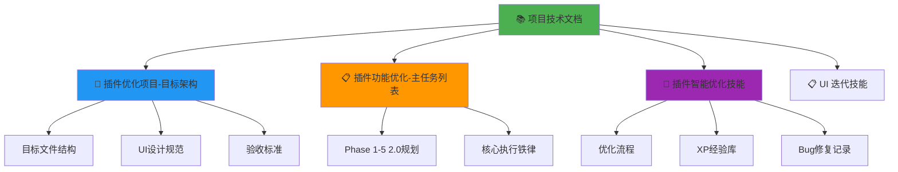

# 📚 Al Brooks Trader Console - 项目技术文档

> **文档类型**: 维护技术手册  
> **版本**: v2.2.0  
> **最后更新**: 2026-01-16  
> **维护者**: Antigravity Agent  
> **状态**: 🟢 活跃维护中

---

## 📖 文档导航

### 核心文档关联图



### 文档索引

| 文档名称 | 用途 | 链接 |
|---------|------|------|
| **本文档** | 项目全局技术手册，快速上下文恢复 | 当前文件 |
| **数据逻辑架构** | 完整数据流与处理逻辑 | [📊 数据逻辑架构文档](./📊%20数据逻辑架构文档.md) |
| **目标架构** | 定义最终目标状态和验收标准 | [🎯 插件优化项目-目标架构](./🎯%20插件优化项目-目标架构.md) |
| **主任务列表** | Phase 1-5 的详细任务分解 | [📋 插件功能优化-主任务列表](../📋%20任务与规划/📋%20插件功能优化-主任务列表.md) |
| **优化技能** | 优化方法论和XP经验库 | [🧠 插件智能优化技能](../🧠%20技能与方法/🧠%20插件智能优化技能.md) |
| **UI迭代技能** | UI设计和迭代方法 | [📋 UI 迭代技能](../🧠%20技能与方法/📋%20UI%20迭代技能（插件控制台）.md) |
| **存档文件夹** | 历史版本和报告 | [./存档/](./存档/) |

---

## 🏗️ 一、项目架构总览

### 1.1 项目基本信息

**项目名称**: Al Brooks Trader Console  
**插件版本**: v2.2.0 (Phase 2 Completed)  
**技术栈**: TypeScript 4.7.4 + React 18.2.0 + esbuild  
**Obsidian最低版本**: 0.15.0  
**代码仓库**: `.obsidian/plugins/al-brooks-console/`

### 1.2 核心目录结构

```
al-brooks-console/
├── src/
│   ├── core/              # 业务逻辑 (25+ 核心模块)
│   │   ├── services/      # 基础服务 (ActionService, Logger)
│   │   └── ...
│   ├── hooks/             # 自定义UI Hooks
│   ├── utils/             # 纯工具函数
│   ├── ui/                # UI组件库 (Design System)
│   ├── views/             # 视图层
│   │   ├── Dashboard.tsx  # 主控制器
│   │   └── tabs/          # 业务布局 (TradingHub, Analytics...)
│   ├── platforms/         # Obsidian平台适配层
│   ├── integrations/      # 外部插件适配 (SRS, Dataview...)
│   ├── types/             # TypeScript类型定义
│   └── main.ts            # 插件入口
├── manifest.json          # 插件清单
└── package.json           # 依赖管理
```

### 1.3 核心功能模块 (Current State)

| 模块 | 状态 | 职责 | 关键组件/类 |
| :--- | :--- | :--- | :--- |
| **Trading Hub** | ✅ 活跃 | 实时作战指挥，整合预测与开仓 | `TradingHubTab`, `ReviewHintsPanel`, `OpenTradeAssistant` |
| **Analytics** | 🟡 维护 | 历史数据深度复盘与透视 | `AnalyticsTab`, `CalendarHeatmap`, `TuitionAnalysis` |
| **Learn** | ✅ 活跃 | 知识内化与间隔复习 | `LearnTab`, `CoachFocus` (集成SRS) |
| **Manage** | 🟡 维护 | 系统元数据管理 | `ManageTab`, `SchemaIssuesPanel` |
| **Core Services** | ✅ 活跃 | 底层数据/写入服务 | `ActionService`, `TradeIndex`, `StrategyMatcherV2` |

---

## 📊 二、代码库详细清单

### 2.1 核心业务模块 (core/)

**新增模块 (v2.2.0)**:
*   `market-state-machine.ts`: **市场状态机**，负责推演 Market Cycle (Trend/TR) 和 Direction，提供 H1/H2 等信号指引。
*   `strategy-matcher-v2.ts`: **策略加权引擎**，基于 Setup, Signal, Context 的加权评分系统。
*   `review-hints.ts`: **智能提示生成器**，检测笔记缺漏（Gap Detection）并生成修复动作。
*   `services/action-service.ts`: **统一写入层**，提供 `updateTrade` 等原子操作，支持 Dry Run 和 Undo。

**原有核心模块**:
*   `trade-index.ts`, `strategy-index.ts`: 内存索引。
*   `analytics.ts`, `hub-analytics.ts`: 数据分析。
*   `coach.ts`, `sm2.ts`: 学习算法。

### 2.2 视图层 (views/)

#### 主控制器
**Dashboard.tsx**: 负责全局 Context (`ConsoleContext`) 初始化、路由分发。
*Context包含*: `runCommand` (执行Obsidian命令), `openFile` (打开文件), `refreshIndex` (手动刷新).

#### Tab组件状态
*   ✅ `TradingHubTab.tsx`: **[Phase 2 完成]**。包含 `TodayPlan`, `ReviewHintsPanel` (智能预测), `OpenTradeAssistant` (开仓助手)。
*   ✅ `LearnTab.tsx`: **[Phase 4 部分完成]**。包含 `CoachFocus` (集成SRS卡片)。
*   🟡 `AnalyticsTab.tsx`: 待重构。
*   🟡 `ManageTab.tsx`: 待重构。

### 2.3 关键特性实现

#### 1. 粘性上下文 (Sticky Context)
*   **位置**: `TradingHubTab.tsx`
*   **逻辑**: 监听 `active-leaf-change`。当用户点击 Dashboard（导致 activeFile 为 null）时，**不清空**当前的 `activeMetadata`，而是保持上一次有效交易笔记的状态。只在检测到新的有效交易笔记（Tag: `#PA/Trade` 或路径包含 `Trades/`）时才更新。
*   **目的**: 防止用户在操作面板时丢失当前交易的上下文预测。

#### 2. 确定性命令执行 (Deterministic Command)
*   **位置**: `DashboardHeader.tsx`, `CoachFocus.tsx`
*   **逻辑**: 调用外部插件（如 Spaced Repetition）时，使用**硬编码的验证ID** (`obsidian-spaced-repetition:srs-review-flashcards`)，并辅以极简 Fallback（模糊匹配仅作为最后的手段）。
*   **目的**: 避免因插件更新或 ID 变更导致的功能失效。

#### 3. 智能字段检测 (Gap Detection)
*   **位置**: `ReviewHintsPanel.tsx`
*   **逻辑**: 实时对比 `activeMetadata` 与策略所需的字段。如果发现有 Setup 但无 Signal，或者有 Pattern 但无 Context，立即提示用户补充。支持点击一键修复（跳转到 Frontmatter）。

---

## 🎯 三、开发路线图与任务状态

详见 [📋 插件功能优化-主任务列表](../📋%20任务与规划/📋%20插件功能优化-主任务列表.md)

### 3.1 已完成里程碑 (Milestones)

#### ✅ Phase 1: 基础架构 (2026-01-05 ~ 01-12)
*   UI标准化 (Glassmorphism)。
*   ActionService (写入层) 实现。
*   Utils/Hooks 拆分。

#### ✅ Phase 1.5: 交易中心集成 (2026-01-12 ~ 01-14)
*   Trading Hub UI 落地。
*   Open Trade Assistant (部分功能)。

#### ✅ Phase 2: 智能增强 (2026-01-15 ~ 01-16)
*   Smart Prediction (市场状态机集成)。
*   Sticky Context (粘性上下文)。
*   SRS Integration (闪卡系统修复)。

### 3.2 进行中 (In Progress)
*   **Phase 3 (Analytics)**: 重构 AnalyticsTab，引入更严格的归因模型。
*   **ActionService 增强**: 批量编辑 (Batch Edit) 和 Quick Fix。

---

## 📏 四、代码质量指标

### 4.1 核心原则 (XP)
1.  **上下文隔离**: 严禁混合 `activeMetadata` (当前文件) 和 `latestTrade` (历史最后一笔)。预测必须基于当前文件，若当前文件为空，则显示“等待信号”，绝不回退到历史数据。
2.  **异步原子性**: 所有文件操作 (`openFile`) 和命令执行 (`runCommand`) 必须是 `async/await`，且UI交互需处理加载状态 (`isActionRunning`)。
3.  **类型安全**: 全面使用 TypeScript 严格模式，避免 `any`。

---

## 🛠️ 五、调试与维护

### 5.1 常见问题排查

**Q: 预测面板显示 "Waiting for Context..."？**
*   检查当前激活的文件是否包含 `#PA/Trade` 标签。
*   检查 Frontmatter 中是否有 `marketCycle` 或 `direction` 字段。

**Q: 点击 SRS 按钮没反应？**
*   检查控制台日志 `[SRS] Command Check`。
*   确认是否安装了 `Spaced Repetition` 插件且已启用。

### 5.2 关键日志 Tag
*   `[SmartPrediction]`: 预测逻辑日志。
*   `[ActionService]`: 写入操作日志。
*   `[SRS]`: 闪卡插件调用日志。

---

## 📚 六、相关文档
*   [🧠 插件智能优化技能 (XP库)](../🧠%20技能与方法/🧠%20插件智能优化技能.md)
*   [📋 UI 迭代技能](../🧠%20技能与方法/📋%20UI%20迭代技能（插件控制台）.md)

---

**最后更新**: 2026-01-16 (v2.2.0)
