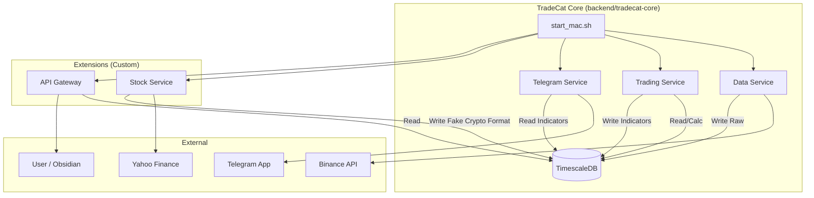

# TradeCat Architecture V2 (Stabilized)

## 🌟 系统概览

本架构采用"官方核心 + 模块化扩展"的设计模式，解决了之前系统混乱、维护困难的问题。

### 核心理念
1.  **Keep Core Clean**: 保持 `backend/tradecat-core` 与官方仓库高度一致，方便后续升级。
2.  **Extensions as Services**: 所有定制功能（如美股、特定策略）作为独立微服务运行。
3.  **Unified Data**: 数据统一汇聚在 TimescaleDB，上层应用（Telegram/Obsidian）对此无感知。

---

## 🏗️ 架构图



## 📂 目录结构 (精简版)

```text
backend/tradecat-core/
├── config/
│   └── .env                # 统一配置文件 (Token, DB URL)
├── services/
│   ├── data-service/       # [官方] 加密货币采集 (Binance)
│   ├── trading-service/    # [官方] 指标计算 (MACD, RSI...)
│   ├── telegram-service/   # [官方] 机器人逻辑
│   ├── stock-service/      # [新增] 美股采集 (yfinance)
│   └── api-gateway/        # [迁移] Obsidian 插件接口
├── scripts/
│   ├── start.sh            # 官方启动脚本 (Linux/Docker)
│   └── start_mac.sh        # ✅ Mac 专用启动脚本 (Python 直接调用)
└── mn_logs/                # 所有服务日志
```

## 🚀 运维指南

### 启动系统
```bash
cd backend/tradecat-core
./scripts/start_mac.sh
```

### 查看日志
日志集中在 `mn_logs/` 目录：
- `data-service.log`: 币安数据采集状态
- `stock-service.log`: 美股/期货采集状态
- `telegram-service.log`: 机器人交互日志
- `api-gateway.log`: Obsidian 插件请求日志

### 添加新美股代码
1. 编辑 `backend/tradecat-core/services/stock-service/src/config.py` (或者 `.env` 如果将来支持)
2. 修改 `STOCK_SYMBOLS` 列表。
3. 重启服务。

## ⚠️ 注意事项
- **美股假像**: 美股数据在数据库中模仿了 Crypto 的格式（Volume 存在，Quote Volume 为 0）。这是为了让 `trading-service` 能够自动计算 MACD 等指标而无需修改代码。
- **端口**:
    - TimescaleDB: 5434
    - API Gateway: 8088
    - Telegram Bot: Polling Mode (无端口)
