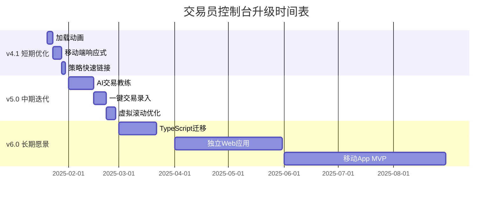

# 🛠️ 交易员控制台 (Trader Command) 升级路线图

> [!abstract] 基于 v4.0 技术报告的全面升级计划
> 
> **当前版本**: v4.0 (2025年1月)  
> **技术栈**: Obsidian DataviewJS + JavaScript + HTML/CSS  
> **代码量**: 16个JS模块, 1964行代码  
> **设计语言**: Modern Glassmorphism v3.0  
> 
> 本计划基于《📋 系统技术报告 v4.0》的全面分析,分为短期优化、中期迭代、长期愿景三个阶段。

---

## 📊 当前状态评估 (v4.0)

### ✅ 已完成的核心功能
- **数据引擎**: pa-core.js 统一数据处理管道
- **主题系统**: Modern Glassmorphism v3.0 (深蓝渐变 + 毛玻璃效果)
- **13个功能视图**: 记忆宫殿、课程进度、策略手册、账户概览等
- **双语支持**: 中文/英文标签系统
- **数据缓存**: 5分钟全局缓存机制

### ⚠️ 已知问题与技术债务
1. **性能瓶颈**: 数据量>500条时DataviewJS查询延迟明显
2. **类型安全**: 纯JavaScript, 无TypeScript类型检查
3. **错误处理**: 缺少统一的错误捕获机制
4. **测试覆盖**: 无单元测试, 依赖手动测试
5. **移动适配**: 小屏幕布局未完全优化
6. **数据验证**: 缺少YAML字段格式校验

---

## 🎯 第一阶段: 短期优化 (v4.1) - 2周内

### 1.1 用户体验增强
- [ ] **加载动画**
  - 文件: `scripts/pa-core.js`
  - 实现: 数据加载时显示骨架屏/Spinner
  - 优先级: ⭐⭐⭐
  
- [ ] **移动端响应式**
  - 文件: `scripts/pa-config.js`
  - 添加: `@media` 断点, 小屏幕下单列布局
  - 优先级: ⭐⭐⭐
  
- [ ] **策略快速链接**
  - 文件: `scripts/pa-view-strategy.js`
  - 功能: 点击策略名称直接跳转到 `Notes 笔记/` 对应文档
  - 优先级: ⭐⭐

### 1.2 数据可视化优化
- [ ] **图表交互增强**
  - 文件: `scripts/pa-view-trend.js`
  - 添加: Tooltip悬停显示详细数据
  - 库选择: 考虑集成 Chart.js 或 D3.js
  - 优先级: ⭐⭐
  
- [ ] **心态监控红绿灯**
  - 文件: `scripts/pa-view-trend.js`
  - 逻辑: 分析最近7笔交易的 `management_error` 标签
  - 显示: 🟢状态极佳 🟡有点起伏 🔴需要暂停
  - 优先级: ⭐⭐⭐

### 1.3 技术债务清理
- [ ] **错误边界**
  - 文件: 所有 `pa-view-*.js`
  - 添加: try-catch + 用户友好错误提示
  - 优先级: ⭐⭐
  
- [ ] **代码注释完善**
  - 范围: 核心函数添加JSDoc注释
  - 优先级: ⭐

---

## 🚀 第二阶段: 中期迭代 (v5.0) - 1-2个月

### 2.1 智能化功能
- [ ] **AI 交易教练**
  - 文件: 新建 `scripts/pa-view-coach.js`
  - 功能:
    - 分析资金曲线趋势(斜率/波动率)
    - 检测连续亏损(>3笔) → 建议暂停实盘
    - 识别策略成功率变化 → 推荐加强训练
  - 技术: 简单统计算法(不依赖外部AI API)
  - 优先级: ⭐⭐⭐
  
- [ ] **市场背景自动感知**
  - 文件: `scripts/pa-view-trend.js`
  - 逻辑: 读取 `Daily/` 最新日记的 `market_cycle` 字段
  - 显示: 在控制台顶部Banner显示"今日: 牛市趋势"/"震荡区间"
  - 优先级: ⭐⭐⭐

### 2.2 快捷操作流
- [ ] **一键交易录入**
  - 文件: 新建 `scripts/pa-quick-entry.js`
  - 界面: 模态窗口输入(品种/方向/策略/盈亏)
  - 输出: 自动生成标准Markdown文件到 `Daily/Trades/`
  - 优先级: ⭐⭐
  
- [ ] **批量标签管理**
  - 文件: 新建 `scripts/pa-tag-manager.js`
  - 功能: 修改多笔交易的标签(如批量标记为"回测")
  - 优先级: ⭐

### 2.3 数据持久化
- [ ] **本地存储优化**
  - 技术: 使用 `localStorage` 缓存用户偏好(主题选择/视图折叠状态)
  - 优先级: ⭐⭐
  
- [ ] **数据备份提醒**
  - 功能: 检测 `Daily/` 超过30天未备份 → 弹窗提醒
  - 优先级: ⭐

### 2.4 性能优化
- [ ] **虚拟滚动**
  - 场景: 综合画廊图片>100张时启用虚拟列表
  - 库选择: 轻量级虚拟滚动库(如 tiny-virtual-list)
  - 优先级: ⭐⭐
  
- [ ] **增量数据加载**
  - 逻辑: 只加载最近90天数据, 点击"加载更多"按钮加载历史
  - 优先级: ⭐⭐

---

## 🌟 第三阶段: 长期愿景 (v6.0+) - 3-6个月

### 3.1 架构升级
- [ ] **TypeScript 迁移**
  - 范围: 核心模块(`pa-core.js`, `pa-config.js`)
  - 收益: 类型安全, 减少运行时错误
  - 工作量: 约2周
  
- [ ] **模块化重构**
  - 目标: 采用ES Modules替代全局变量
  - 文件结构:
    ```
    scripts/
    ├── core/
    │   ├── engine.ts
    │   └── cache.ts
    ├── views/
    │   ├── account/
    │   └── trend/
    └── utils/
        └── helpers.ts
    ```
  
- [ ] **单元测试**
  - 框架: Jest + Testing Library
  - 覆盖率目标: 核心函数>80%

### 3.2 跨平台扩展
- [ ] **独立Web应用**
  - 技术栈: React/Vue + Vite
  - 功能: 脱离Obsidian独立运行
  - 数据源: 读取Markdown文件或连接API
  
- [ ] **移动App (MVP)**
  - 框架: React Native / Flutter
  - 核心功能: 快速记录交易 + 查看账户概览
  
- [ ] **数据同步**
  - 方案: iCloud/Google Drive文件同步
  - 或: 搭建简单后端(Firebase/Supabase)

### 3.3 协作功能
- [ ] **多用户支持**
  - 场景: 导师查看学员交易记录
  - 实现: 权限系统 + 用户隔离
  
- [ ] **社区模板库**
  - 功能: 分享/下载策略配置模板
  - 平台: GitHub Discussions

---

## 🔧 技术优化路线图

### 代码质量
| 项目 | 当前状态 | 目标 | 时间线 |
|------|---------|------|--------|
| TypeScript | 0% | 50% | v6.0 |
| 单元测试 | 0% | 80% | v6.0 |
| 代码注释 | 30% | 90% | v4.1 |
| ESLint/Prettier | 无 | 已配置 | v5.0 |

### 性能指标
| 指标 | 当前 | v5.0目标 | v6.0目标 |
|------|------|---------|---------|
| 首次加载 | 2-3秒 | <1秒 | <500ms |
| 数据查询 | 500ms | <200ms | <100ms |
| 内存占用 | ~50MB | <30MB | <20MB |

### 浏览器兼容性
- **当前**: Chrome/Edge (Obsidian内核)
- **v5.0**: Safari, Firefox
- **v6.0**: 移动浏览器优化

---

## 📅 里程碑时间表



---

## 🎓 开发指南

### 新功能开发流程
1. **需求分析**: 确认功能对交易决策的实际价值
2. **技术设计**: 选择合适的实现方案(避免过度工程)
3. **原型验证**: 在分支上快速实现MVP
4. **用户测试**: 至少5次真实交易场景测试
5. **代码审查**: 检查性能影响和向后兼容性
6. **文档更新**: 更新技术报告和用户指南

### 代码风格规范
- **命名**: 驼峰式(camelCase), 清晰语义
- **注释**: 复杂逻辑必须添加说明
- **格式化**: 2空格缩进, 单引号字符串
- **提交**: 遵循 Conventional Commits (feat/fix/docs)

---

## 📞 反馈与贡献

### 优先级评估标准
- ⭐⭐⭐ **高优先级**: 影响核心交易决策, 提升效率>30%
- ⭐⭐ **中优先级**: 改善用户体验, 减少操作步骤
- ⭐ **低优先级**: 锦上添花功能

### 如何参与
1. **提交Issue**: 在GitHub仓库报告Bug或建议新功能
2. **讨论区**: 加入Obsidian社区讨论交易系统设计
3. **Pull Request**: 遵循开发指南提交代码

---

> [!success] 核心原则
> **简单实用 > 功能堆砌**  
> **交易决策 > 数据展示**  
> **稳定可靠 > 炫酷特效**
> 
> 所有升级都应服务于一个目标:**帮助交易员做出更理性的决策。**
