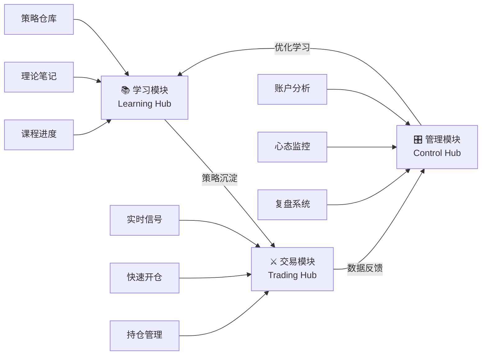
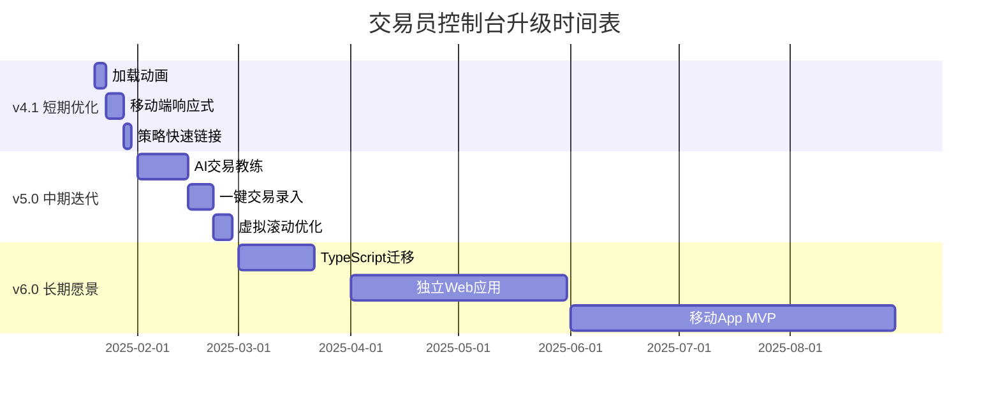

# 🛠️ 交易员控制台 (Trader Command) 升级路线图

> [!abstract] 基于 v4.0 技术报告的全面升级计划
>
> **当前版本**: v4.0 (2025 年 1 月)  
> **技术栈**: Obsidian DataviewJS + JavaScript + HTML/CSS  
> **代码量**: 16 个 JS 模块, 1964 行代码  
> **设计语言**: Modern Glassmorphism v3.0
>
> 本计划基于《📋 系统技术报告 v4.0》的全面分析,分为短期优化、中期迭代、长期愿景三个阶段。

---

## 🎯 核心理念升级 (v4.0 → v5.0)

### 三大模块重构战略

当前系统有 13 个独立视图,功能分散。**v5.0 将整合为三大核心模块**,形成完整的学习 → 交易 → 管理闭环:



#### 📚 模块一: 学习模块 (Learning Hub)

**目标**: 知识积累 → 策略沉淀 → 可执行指南

| 子模块   | 当前状态    | 升级方向                                                    |
| -------- | ----------- | ----------------------------------------------------------- |
| 课程进度 | ✅ 已有     | 增加知识图谱可视化                                          |
| 记忆宫殿 | ✅ 已有     | 关联策略库自动标记                                          |
| 策略仓库 | ⚠️ 静态剧本 | **升级为动态策略库**<br/>支持自定义策略、标签筛选、信号触发 |
| 术语表   | ✅ 已有     | 集成到实时提示系统                                          |

**核心功能升级**:

- **策略自定义系统**: 从"策略剧本"升级为"策略仓库"
  - 支持用户自建策略卡片(课程学习时记录)
  - 每个策略包含: 入场条件、止损规则、目标位计算、失败模式
  - 通过属性/标签自动分类(市场周期、设置类别、胜率等级)
- **智能策略匹配**: 根据当前市场状态(趋势/区间/突破)自动推荐高胜率策略
- **学习路径追踪**: 课程笔记 → 策略提炼 → 实战验证 → Playbook 沉淀

#### ⚔️ 模块二: 交易模块 (Trading Hub)

**目标**: 盘前准备 → 盘中执行 → 实时管理

| 子模块   | 当前状态 | 升级方向                                                           |
| -------- | -------- | ------------------------------------------------------------------ |
| 市场态势 | ❌ 无    | **新建: 自动识别当前市场周期**<br/>读取 Daily 日记 + 实时 K 线判断 |
| 信号识别 | ❌ 无    | **新建: 基于策略库的信号系统**<br/>匹配当前形态 → 推送可用策略     |
| 快速开仓 | ❌ 无    | **新建: 一键交易录入**<br/>模态窗口 → 自动创建 Trade 笔记          |
| 综合画廊 | ✅ 已有  | 升级为"案例库" + 相似形态搜索                                      |

**核心功能升级**:

- **市场背景自动感知**:
  - 读取 `Daily/` 最新日记的 `market_cycle` 字段
  - 分析最近 10 根 K 线: 是否突破均线/形成新高低点
  - 在控制台顶部显示: 🟢 强趋势 🟡 震荡 🔴 突破模式
- **策略信号系统**:
  - 用户手动输入当前观察(如"20EMA 回调+强阳线")
  - 系统从策略仓库筛选匹配策略 → 显示入场规则
  - 自动计算风险回报比(基于历史数据)
- **预测系统(概率导向)**:
  - 基于当前市场周期 + 信号 K 质量
  - 给出下一步大概率走势(如"回调后继续上涨 65%")
  - 数据来源: 历史相似形态的统计结果

#### 🎛️ 模块三: 管理模块 (Control Hub)

**目标**: 数据监控 → 风险控制 → 复盘优化

| 子模块   | 当前状态 | 升级方向                  |
| -------- | -------- | ------------------------- |
| 账户概览 | ✅ 已有  | 增加资金曲线斜率分析      |
| 趋势分析 | ✅ 已有  | 增加策略成功率对比图      |
| 心态监控 | ⚠️ 基础  | **升级为红绿灯预警系统**  |
| AI 教练  | ❌ 无    | **新建: 自动诊断 + 建议** |
| 复盘管理 | ⚠️ 手动  | **升级为结构化复盘流程**  |

**核心功能升级**:

- **心态红绿灯系统**:
  - 分析最近 7 笔交易的 `execution_quality`
  - 🟢 状态极佳: 0 个红色标记
  - 🟡 注意风险: 1-2 个 FOMO/恐慌平仓
  - 🔴 必须暂停: ≥3 个红色标记 或 连续 3 笔亏损
- **AI 交易教练**:
  - 资金曲线分析: 斜率为负且波动率>30% → "建议回模拟盘"
  - 策略效率分析: 某策略成功率<40% → "停止使用该策略"
  - 交易频率监控: 日均交易>15 笔 → "警告: 过度交易"

---

## 📊 当前状态评估 (v4.0)

### ✅ 已完成的核心功能

- **数据引擎**: pa-core.js 统一数据处理管道
- **主题系统**: Modern Glassmorphism v3.0 (深蓝渐变 + 毛玻璃效果)
- **13 个功能视图**: 记忆宫殿、课程进度、策略手册、账户概览等
- **双语支持**: 中文/英文标签系统
- **数据缓存**: 5 分钟全局缓存机制

### ⚠️ 已知问题与技术债务

1. **性能瓶颈**: 数据量>500 条时 DataviewJS 查询延迟明显
2. **类型安全**: 纯 JavaScript, 无 TypeScript 类型检查
3. **错误处理**: 缺少统一的错误捕获机制
4. **测试覆盖**: 无单元测试, 依赖手动测试
5. **移动适配**: 小屏幕布局未完全优化
6. **数据验证**: 缺少 YAML 字段格式校验

---

## 💡 额外优化建议 (Additional Ideas)

基于系统分析,以下是更多可以优化的方向:

### 1. 数据可视化增强

- [ ] **策略雷达图**: 显示每个策略在不同市场周期下的成功率
- [ ] **时间热力图**: 哪个时间段(开盘/午盘/尾盘)交易效果最好
- [ ] **品种对比图**: ES vs NQ vs BTC 成功率对比
- [ ] **心态曲线图**: 心态评分随时间变化趋势

### 2. 智能提醒系统

- [ ] **盘前提醒**: 每日开盘前 30 分钟推送今日市场状态和建议策略
- [ ] **连亏预警**: 连续 3 笔亏损后弹窗强制休息
- [ ] **过度交易提醒**: 单日交易超过 10 笔时警告
- [ ] **策略失效提醒**: 某策略连续 5 次失败后建议停用

### 3. 社区与协作

- [ ] **策略分享功能**: 导出策略卡片为 JSON,分享给其他交易员
- [ ] **案例库评分**: 为每个交易案例点赞/收藏
- [ ] **导师模式**: 查看学员的交易记录和策略使用情况
- [ ] **Discord/Slack 集成**: 自动发送每日复盘报告到社群

### 4. 学习路径优化

- [ ] **知识图谱**: 可视化课程笔记、策略、交易案例之间的关联
- [ ] **间隔重复系统**: 基于遗忘曲线自动安排策略复习
- [ ] **进度追踪**: 显示每个策略的"熟练度" (初学/熟练/精通)
- [ ] **技能树系统**: 游戏化展示交易技能成长路径

### 5. 风险管理工具

- [ ] **仓位计算器**: 基于账户余额和风险比例自动计算下单手数
- [ ] **回撤分析**: 计算最大回撤、夏普比率、卡玛比率
- [ ] **压力测试**: 模拟连续 10 笔亏损对账户的影响
- [ ] **Kelly 公式**: 基于胜率和盈亏比计算最优仓位

### 6. 自动化工作流

- [ ] **语音录入**: 用手机语音记录交易,自动转为 Markdown
- [ ] **图表自动截图**: 集成 TradingView API 自动保存图表
- [ ] **Excel/CSV 导出**: 将交易数据导出为券商要求格式
- [ ] **自动备份**: 每周自动将 Vault 备份到 GitHub/云盘

### 7. 移动端体验

- [ ] **快速看盘模式**: 移动端简化界面,只显示核心指标
- [ ] **通知推送**: 重要提醒推送到手机
- [ ] **离线模式**: 无网络时仍可查看本地数据
- [ ] **语音播报**: 开车时语音播报账户状态

### 8. 心理训练工具

- [ ] **模拟压力**: 播放市场噪音,训练抗干扰能力
- [ ] **冥想计时器**: 盘前冥想 5 分钟,调整状态
- [ ] **情绪日记**: 记录每笔交易的情绪变化曲线
- [ ] **胜负思维训练**: 随机展示历史亏损案例,练习接受失败

### 9. 性能监控

- [ ] **系统健康检查**: 定期检测数据完整性
- [ ] **查询性能优化**: 自动索引常用字段
- [ ] **缓存策略**: 智能预加载下次可能查看的数据
- [ ] **懒加载**: 图片和图表按需加载

### 10. 合规与安全

- [ ] **数据加密**: 敏感信息(账户余额)加密存储
- [ ] **访问日志**: 记录谁何时查看了哪些数据
- [ ] **权限控制**: 导师只能查看,不能修改学员数据
- [ ] **数据脱敏**: 导出案例时自动隐藏金额信息

---

## 🎯 第一阶段: 短期优化 (v4.1) - 2 周内

### 📝 v4.1.0 实施记录 (2025-12-20)

#### ✅ 已完成项目

- ✅ **策略仓库展示增强**

  - 文件: `scripts/pa-view-playbook.js`
  - 功能: 卡片展开/收起、显示更多策略信息、修复跳转链接
  - 状态: 已上线

- ✅ **今日实时监控面板**

  - 文件: `scripts/pa-view-today.js` (新建)
  - 功能: 今日交易统计、最近 5 笔交易列表、进行中提醒
  - 状态: 已集成到控制台

- ✅ **属性系统扩展**
  - 文件: `Templates/属性值预设.md`
  - 新增: `patterns_observed`、`matched_strategy` 属性
  - 定义: 17 种标准形态值
  - 状态: 已完成,待验证使用方式

#### ⚠️ 待重新评估项目

- ⏸️ **交易模板集成图表分析**

  - 文件: `Templates/单笔交易模版 (Trade Note).md`
  - 尝试: 添加形态识别 section + 智能策略推荐引擎
  - 问题: 用户反馈流程复杂化,需重新设计
  - 状态: 暂停,等待用户确认理想工作流

- ⏸️ **属性桥梁系统设计**
  - 理念: 通过属性打通笔记 → 策略 → 控制台
  - 问题: 当前实现方式不符合实际使用习惯
  - 状态: 需要重新讨论和设计

#### 🤔 核心问题反思

1. **图表分析的位置**

   - 是否需要独立的图表分析笔记类型?
   - 还是应该在交易笔记中轻量化集成?
   - 形态识别应该在盘前、盘中还是盘后?

2. **策略推荐的触发时机**

   - 自动推荐 vs 手动查询?
   - 在创建笔记时 vs 填写属性后?
   - DataviewJS 实时计算 vs 预设策略字段?

3. **属性系统的复杂度**
   - 17 种形态是否过于细分?
   - 用户是否愿意每次都勾选形态?
   - 能否通过更简单的方式实现匹配?

#### 📋 用户反馈待确认

- [ ] 理想的交易流程是什么?(盘前 → 盘中 → 盘后)
- [ ] 图表分析应该如何融入笔记系统?
- [ ] 形态识别是否应该自动化?(如通过 AI 识别图表)
- [ ] 策略推荐应该在哪个环节触发?
- [ ] 当前单笔交易模板哪些部分好用,哪些需要改进?

---

### 1.1 用户体验增强 (待继续)

- [ ] **加载动画**
  - 文件: `scripts/pa-core.js`
  - 实现: 数据加载时显示骨架屏/Spinner
  - 优先级: ⭐⭐⭐
- [ ] **移动端响应式**
  - 文件: `scripts/pa-config.js`
  - 添加: `@media` 断点, 小屏幕下单列布局
  - 优先级: ⭐⭐⭐
- [ ] **策略快速链接**
  - 文件: `scripts/pa-view-strategy.js`
  - 功能: 点击策略名称直接跳转到 `Notes 笔记/` 对应文档
  - 优先级: ⭐⭐

### 1.2 数据可视化优化

- [ ] **图表交互增强**
  - 文件: `scripts/pa-view-trend.js`
  - 添加: Tooltip 悬停显示详细数据
  - 库选择: 考虑集成 Chart.js 或 D3.js
  - 优先级: ⭐⭐
- [ ] **心态监控红绿灯**
  - 文件: `scripts/pa-view-trend.js`
  - 逻辑: 分析最近 7 笔交易的 `management_error` 标签
  - 显示: 🟢 状态极佳 🟡 有点起伏 🔴 需要暂停
  - 优先级: ⭐⭐⭐

### 1.3 技术债务清理

- [ ] **错误边界**
  - 文件: 所有 `pa-view-*.js`
  - 添加: try-catch + 用户友好错误提示
  - 优先级: ⭐⭐
- [ ] **代码注释完善**
  - 范围: 核心函数添加 JSDoc 注释
  - 优先级: ⭐

---

## 🗂️ 数据结构优化方案 (Templates & Schema)

基于对现有模板、属性、标签体系的分析,提出以下优化方案:

### 一、属性系统重构 (Properties Optimization)

#### 当前问题

1. **属性分散**: 交易单、日记、课程笔记使用不同属性,缺乏统一性
2. **缺少关联**: 策略名称仅存在于笔记内容,无法自动筛选和统计
3. **标签冗余**: 部分信息同时存在于属性和标签中

#### 优化方案: 统一属性架构

**核心属性字段 (所有笔记通用)**:

```yaml
# === 系统属性 (System) ===
categories: [] # 笔记分类 (交易单/日记/课程/策略)
tags: [] # 系统标签 (#PA/Trade, #PA/Daily, #PA/Course, #PA/Strategy)
date: YYYY-MM-DD # 日期
封面/cover: "" # 封面图

# === 业务属性 (Business) ===
账户类型/account_type: "" # 实盘/模拟/回测
品种/ticker: "" # ES/NQ/BTC等
时间周期/timeframe: "" # 5m/15m/1H等
```

**交易单专属属性** (`#PA/Trade`):

```yaml
# === 市场分析 ===
市场周期/market_cycle: "" # 强趋势/弱趋势/交易区间/突破模式
设置类别/setup_category: "" # 趋势回调/突破跟随/区间反转/假突破
策略名称/strategy_name: "" # ⭐ 新增: MTR/H2/双顶等 (关联策略仓库)
信号K质量/signal_bar_quality: "" # 强/中/弱

# === 交易执行 ===
方向/direction: "" # 做多/做空
订单类型/order_type: "" # 止损单/限价单/市价单
入场/entry_price: 0
止损/stop_loss: 0
目标位/take_profit: 0
初始风险/initial_risk: 0
净利润/net_profit: 0

# === 结果与复盘 ===
结果/outcome: "" # 止盈/止损/保本
执行评价/execution_quality: "" # 完美执行/主动离场/恐慌平仓/FOMO等
管理错误/management_error: [] # ⭐ 新增: [FOMO, Tilt, 过度交易] (多选)
复盘深度/review_depth: "" # 快速回顾/深度分析/写入Playbook
```

**日记专属属性** (`#PA/Daily`):

```yaml
市场周期/market_cycle: "" # 今日市场状态
心态评分/mindset_score: 0 # ⭐ 新增: 1-10分
是否出现FOMO/has_fomo: false # ⭐ 新增: 布尔值
总交易数/total_trades: 0 # ⭐ 新增: 自动统计
胜率/win_rate: 0 # ⭐ 新增: 自动计算
```

**课程笔记专属属性** (`#PA/Course`):

```yaml
module_id: "" # 课程编号
studied: false # 是否已学习
提炼策略/extracted_strategies: [] # ⭐ 新增: 从课程提炼的策略列表
关联知识/associated_knowledge: [] # 关联其他笔记
```

**策略卡片专属属性** (`#PA/Strategy` ⭐ 新增):

```yaml
策略名称/strategy_name: "" # MTR/H2/双顶等
市场周期/market_cycle: [] # 适用市场 (多选)
设置类别/setup_category: "" # 回调/突破/反转
胜率/win_rate: 0 # 历史胜率 (自动统计)
盈亏比/risk_reward: "" # 如 "2:1"
使用次数/usage_count: 0 # ⭐ 新增: 自动统计该策略被使用次数
最近使用/last_used: "" # ⭐ 新增: 最近一次使用日期
策略状态/strategy_status: "" # ⭐ 新增: 学习中/验证中/已掌握/已淘汰
来源/source: "" # Al Brooks课程/自创/社区
入场条件/entry_conditions: "" # 文本描述
止损规则/stop_rules: ""
目标位规则/target_rules: ""
失败模式/failure_mode: "" # 什么情况下该策略会失败
```

### 二、标签系统重构 (Tags Optimization)

#### 当前问题

1. **标签功能重叠**: 如 `#PA/Textbook` 和 `执行评价: 完美执行` 都表达"优质案例"
2. **缺少动态标签**: 无法标记"待验证策略"、"需要加强训练"等临时状态
3. **与属性界限不清**: 部分标签应该是属性

#### 优化方案: 精简标签体系

**保留核心标签** (系统必需,不可修改):

```
#PA/Trade   - 交易单
#PA/Daily   - 每日日记
#PA/Course  - 课程笔记
#PA/Strategy - ⭐ 新增: 策略卡片
```

**新增功能标签** (用户管理):

```
# 质量标记
#PA/Textbook    - 教科书级案例 (保留)
#PA/Warning     - ⭐ 新增: 反面教材 (用于警示)

# 工作流标签
#PA/Print       - 待打印 (保留)
#PA/ToReview    - ⭐ 新增: 需要复盘
#PA/ToVerify    - ⭐ 新增: 策略待验证
#PA/ToMaster    - ⭐ 新增: 需要反复练习

# 记忆系统 (保留)
#flashcards     - 制卡
#review         - 复习队列
```

**删除冗余标签**:

- 删除: 按市场周期、品种、策略分类的标签文件夹 (如 `#牛市趋势`, `#ES`)
- 原因: 这些信息已在属性中,通过 Dataview 筛选更高效

### 三、模板文件优化 (Templates Enhancement)

#### 3.1 交易单模板优化

**文件**: `Templates/单笔交易模版 (Trade Note).md`

**优化点**:

1. ✅ 保留风险计算器 (非常实用)
2. ⭐ 新增"策略选择器":
   ````markdown
   > [!tip] 策略快速选择
   >
   > ```dataviewjs
   > // 从策略仓库读取所有策略,点击后自动填充strategy_name
   > const strategies = dv.pages('#PA/Strategy');
   > for(let s of strategies) {
   >   dv.paragraph(`[[${s.file.name}]] - ${s["市场周期"]} | 胜率: ${s["胜率"]}%`);
   > }
   > ```
   ````
3. ⭐ 新增"相似案例推荐":
   ````markdown
   > [!example] 历史相似案例
   >
   > ```dataviewjs
   > // 查找相同策略+相同市场周期的历史交易
   > const current = dv.current();
   > const similar = dv.pages('#PA/Trade')
   >   .where(p => p["策略名称"] == current["策略名称"]
   >            && p["市场周期"] == current["市场周期"])
   >   .limit(5);
   > dv.table(["日期", "结果", "盈亏"],
   >   similar.map(p => [p.date, p.结果, p.净利润]));
   > ```
   ````

#### 3.2 每日日记模板优化

**文件**: `Templates/每日复盘模版 (Daily Journal).md`

**优化点**:

1. ⭐ 新增"策略使用统计":

   ````markdown
   ### 📊 策略表现

   ```dataviewjs
   // 统计今天使用的策略及其成功率
   const today = dv.current().date;
   const trades = dv.pages('#PA/Trade')
     .where(p => p.date == today);
   // 按策略分组统计
   ```
   ````

2. ⭐ 新增"心态红绿灯自动评估":

   ````markdown
   ### 🚦 心态状态

   ```dataviewjs
   // 分析最近7笔交易的execution_quality
   // 自动显示 🟢🟡🔴
   ```
   ````

#### 3.3 课程笔记模板优化

**文件**: `Templates/理论模版 (Concept Template).md`

**优化点**:

1. ⭐ 新增"策略提炼区":

   ```markdown
   ## 📌 策略提炼 (Strategy Extraction)

   > 从本节课中提炼出的可执行策略:

   - [ ] **策略 1: [名称]**
     - 入场条件:
     - 止损:
     - 目标:
     - → [[创建策略卡片]]
   ```

2. ✅ 保留优劣对比表 (非常实用)
3. ⭐ 新增"实战验证进度":

   ````markdown
   ## ✅ 实战验证

   ```dataviewjs
   // 查找使用本课程策略的交易记录
   // 显示: 已验证X次, 成功率Y%
   ```
   ````

#### 3.4 新增: 策略卡片模板

**文件**: `Templates/策略卡片模版 (Strategy Card).md` ⭐ 新建

````markdown
---
categories: [策略]
tags: [PA/Strategy]
策略名称/strategy_name:
市场周期/market_cycle: []
设置类别/setup_category:
胜率/win_rate: 0
盈亏比/risk_reward:
使用次数/usage_count: 0
最近使用/last_used:
策略状态/strategy_status: 学习中
来源/source:
封面/cover:
---

# 🎯 策略概览

**一句话描述**:
_(例如: 强趋势中,20EMA 回调形成 H2 信号后的顺势入场)_

---

## 📋 入场条件 (Entry Criteria)

### 市场背景要求

- [ ] 市场周期: 强趋势 / 弱趋势 / 交易区间 / 突破模式
- [ ] 波段结构: HH/HL (牛) 或 LH/LL (熊)
- [ ] 均线关系: 价格在 20EMA 之上(牛) / 之下(熊)

### 信号棒特征

- [ ] K 线形态:
- [ ] 收盘位置: 强收盘 (光头光脚)
- [ ] 是否有重叠: 少重叠 / 无重叠
- [ ] 上下影线: 无长影线 / 有小影线

### 计数要求

- [ ] H1/H2 或 L1/L2
- [ ] 回调幅度: <50% / <38.2%
- [ ] 距离均线: <5 根 K 线

---

## 🛡️ 风险管理 (Risk Management)

### 止损位置

- **标准**: 信号棒极值外 2-4 跳
- **宽松**: 前一波段极值外
- **紧密**: 入场棒中点

### 目标位计算

- **保守**: 1:1 (初始风险)
- **标准**: 1.5:1 - 2:1
- **激进**: 测量移动 (Measured Move)

### 仓位管理

- **学习阶段**: 最小仓位 (1 手)
- **验证阶段**: 25%仓位
- **熟练阶段**: 50%仓位

---

## ⚠️ 失败模式 (Failure Signals)

当出现以下情况,立即退出或不入场:

- [ ] 信号棒收盘有长影线
- [ ] 入场棒立即反向突破信号棒
- [ ] 连续 3 根 K 线重叠 (铁丝网)
- [ ] 突破后无跟进 (Follow-through 弱)

---

## 📊 历史表现 (Performance)

```dataviewjs
// 自动统计使用该策略的所有交易
const strategyName = dv.current()["策略名称"];
const trades = dv.pages('#PA/Trade')
  .where(p => p["策略名称"] == strategyName);

const wins = trades.where(p => p.结果 == "止盈").length;
const total = trades.length;
const winRate = total > 0 ? (wins/total*100).toFixed(1) : 0;

dv.paragraph(`**总使用次数**: ${total} | **成功**: ${wins} | **胜率**: ${winRate}%`);

// 显示最近5次交易
dv.header(3, "最近交易记录");
dv.table(["日期", "品种", "结果", "盈亏"],
  trades.sort(p => p.date, 'desc').limit(5)
    .map(p => [p.date, p.品种, p.结果, p.净利润]));
```
````

---

## 🎓 学习笔记 (Notes)

### 课程来源

- **视频**: [[]]
- **章节**:
- **时间码**:

### 关键要点

1.
2.
3.

### 个人理解

_(记录你对这个策略的独特理解和经验)_

---

## 📸 案例图库 (Gallery)

### ✅ 成功案例

![[]]
_分析: _

### ❌ 失败案例

![[]]
_分析: _

---

## 🔄 版本历史

- **v1.0** (2025-01-20): 初始创建,从 Al Brooks 课程提炼
- **v1.1** (2025-02-05): 优化止损规则,胜率从 45%提升至 58%
- **v2.0** (2025-03-10): 标记为"已掌握",进入实盘使用

````

### 四、术语表优化 (Glossary Enhancement)

**文件**: `Templates/PA_Glossary(术语表).md`

**优化点**:
1. ✅ 保留现有术语表结构 (非常完善)
2. ⭐ 新增"术语关联策略":
   ```markdown
   | 缩写 | 全称 | 中文 | 解释 | 关联策略 |
   |------|------|------|------|----------|
   | MTR | Major Trend Reversal | 主要趋势反转 | ... | [[MTR策略卡片]] |
   | H2 | High 2 | 高2 | ... | [[H2 Setup策略卡片]] |
````

3. ⭐ 新增"实时查询功能":
   ````markdown
   > [!tip] 快速查询
   >
   > ```dataviewjs
   > // 输入缩写,自动显示完整定义和案例
   > ```
   ````

### 五、属性值预设优化

**文件**: `Templates/属性值预设.md`

**新增字段**:

```yaml
策略名称/strategy_name:
  - MTR (主要趋势反转)
  - H2 Setup (高2)
  - L2 Setup (低2)
  - Double Top/Bottom (双顶双底)
  - Wedge Reversal (楔形反转)
  - Failed Breakout (假突破)
  - Moving Average Gap (均线缺口)
  - Triangle Breakout (三角形突破)
  - ⭐ 自定义策略

管理错误/management_error:
  - FOMO (Fear of Missing Out)
  - Tilt (情绪化交易)
  - 过度交易 (Overtrading)
  - 扛单不止损 (No Stop Loss)
  - 追涨杀跌 (Chasing)
  - 盲目加仓 (Scaling Too Early)

策略状态/strategy_status:
  - 学习中 (Learning)
  - 验证中 (Testing)
  - 已掌握 (Mastered)
  - 需要加强 (Need Practice)
  - 已淘汰 (Deprecated)

心态评分/mindset_score:
  - 1 - 极差 (崩溃边缘)
  - 5 - 一般 (有起伏)
  - 10 - 完美 (冷静理性)
```

---

## 🎯 数据结构升级实施计划

### 阶段一: 属性字段扩展 (v5.0)

1. 更新所有模板文件,添加新属性字段
2. 修改 `pa-core.js` 数据引擎,兼容新字段
3. 更新 `属性值预设.md` 文件

### 阶段二: 策略仓库搭建 (v5.0)

1. 创建 `策略卡片模版.md`
2. 从现有笔记中提炼 3-5 个核心策略
3. 开发 `pa-view-repository.js` 视图
4. 实现策略筛选和匹配功能

### 阶段三: 标签系统精简 (v5.1)

1. 清理冗余标签文件夹
2. 批量修改现有笔记,迁移到新标签体系
3. 更新 `PA标签体系.md` 文档

### 阶段四: 模板功能增强 (v5.2)

1. 为所有模板添加 DataviewJS 自动统计功能
2. 实现策略选择器和相似案例推荐
3. 优化交互体验

---

## 🚀 第二阶段: 中期迭代 (v5.0) - 1-2 个月

### 2.1 智能化功能

- [ ] **策略仓库系统 (Strategy Repository)** ⭐⭐⭐

  - 文件: 新建 `scripts/pa-view-repository.js`
  - 功能:
    - 支持自定义策略卡片创建(课程笔记 → 策略提炼)
    - 每个策略包含: 入场条件、市场周期、信号特征、止损规则、目标位、历史成功率
    - 通过属性筛选: 市场周期(趋势/区间/突破) + 设置类别(回调/突破/反转)
    - 点击策略名称 → 跳转到对应笔记或显示详细操作指南
  - 数据结构:
    ```yaml
    策略名称/strategy_name: MTR (主要趋势反转)
    市场周期/market_cycle: [强趋势, 弱趋势/通道]
    设置类别/setup_category: 区间反转 (Reversal)
    入场条件/entry_conditions:
      - 趋势线突破
      - 重测极值失败
      - 形成更高低点(牛)或更低高点(熊)
    信号K要求/signal_requirements: 强收盘, 无长影线
    止损位置/stop_placement: 信号棒极值外2-4跳
    目标位/target: 测量移动 (Measured Move)
    胜率/win_rate: 40%
    盈亏比/risk_reward: 2:1 - 3:1
    失败模式/failure_mode: 突破后立即反转回区间
    ```
  - 优先级: ⭐⭐⭐

- [ ] **市场信号匹配系统** ⭐⭐⭐

  - 文件: 新建 `scripts/pa-signal-matcher.js`
  - 功能:
    - 读取当前市场状态(从 Daily 日记或手动输入)
    - 从策略仓库筛选适用策略
    - 显示: 策略名称、入场条件、止损位置、预期盈亏比
    - 概率预测: 基于历史相似形态统计下一步走势概率
  - 界面:

    ```
    当前市场: 🟢 强趋势 + 20EMA回调

    匹配策略 (3个):
    1. [H2 Setup] - 胜率 65% | R/R 2:1 → 查看详情
    2. [Moving Average Gap] - 胜率 58% | R/R 1.5:1 → 查看详情
    3. [Small Pullback] - 胜率 60% | R/R 1:1 → 查看详情

    概率预测:
    ↗️ 回调后继续上涨: 68% (基于23个历史案例)
    ↘️ 转为震荡: 22%
    ⚠️ 反转: 10%
    ```

  - 优先级: ⭐⭐⭐

- [ ] **AI 交易教练**
  - 文件: 新建 `scripts/pa-view-coach.js`
  - 功能:
    - 分析资金曲线趋势(斜率/波动率)
    - 检测连续亏损(>3 笔) → 建议暂停实盘
    - 识别策略成功率变化 → 推荐加强训练
    - 交易频率监控 → 警告过度交易
  - 技术: 简单统计算法(不依赖外部 AI API)
  - 优先级: ⭐⭐⭐
- [ ] **市场背景自动感知**
  - 文件: `scripts/pa-view-trend.js`
  - 逻辑: 读取 `Daily/` 最新日记的 `market_cycle` 字段
  - 显示: 在控制台顶部 Banner 显示"今日: 牛市趋势"/"震荡区间"
  - 优先级: ⭐⭐⭐

### 2.2 快捷操作流

- [ ] **一键交易录入**
  - 文件: 新建 `scripts/pa-quick-entry.js`
  - 界面: 模态窗口输入(品种/方向/策略/盈亏)
  - 输出: 自动生成标准 Markdown 文件到 `Daily/Trades/`
  - 优先级: ⭐⭐
- [ ] **批量标签管理**
  - 文件: 新建 `scripts/pa-tag-manager.js`
  - 功能: 修改多笔交易的标签(如批量标记为"回测")
  - 优先级: ⭐

### 2.3 数据持久化

- [ ] **本地存储优化**
  - 技术: 使用 `localStorage` 缓存用户偏好(主题选择/视图折叠状态)
  - 优先级: ⭐⭐
- [ ] **数据备份提醒**
  - 功能: 检测 `Daily/` 超过 30 天未备份 → 弹窗提醒
  - 优先级: ⭐

### 2.4 性能优化

- [ ] **虚拟滚动**
  - 场景: 综合画廊图片>100 张时启用虚拟列表
  - 库选择: 轻量级虚拟滚动库(如 tiny-virtual-list)
  - 优先级: ⭐⭐
- [ ] **增量数据加载**
  - 逻辑: 只加载最近 90 天数据, 点击"加载更多"按钮加载历史
  - 优先级: ⭐⭐

---

## 🌟 第三阶段: 长期愿景 (v6.0+) - 3-6 个月

### 3.1 架构升级

- [ ] **TypeScript 迁移**
  - 范围: 核心模块(`pa-core.js`, `pa-config.js`)
  - 收益: 类型安全, 减少运行时错误
  - 工作量: 约 2 周
- [ ] **模块化重构**
  - 目标: 采用 ES Modules 替代全局变量
  - 文件结构:
    ```
    scripts/
    ├── core/
    │   ├── engine.ts
    │   └── cache.ts
    ├── views/
    │   ├── account/
    │   └── trend/
    └── utils/
        └── helpers.ts
    ```
- [ ] **单元测试**
  - 框架: Jest + Testing Library
  - 覆盖率目标: 核心函数>80%

### 3.2 跨平台扩展

- [ ] **独立 Web 应用**
  - 技术栈: React/Vue + Vite
  - 功能: 脱离 Obsidian 独立运行
  - 数据源: 读取 Markdown 文件或连接 API
- [ ] **移动 App (MVP)**
  - 框架: React Native / Flutter
  - 核心功能: 快速记录交易 + 查看账户概览
- [ ] **数据同步**
  - 方案: iCloud/Google Drive 文件同步
  - 或: 搭建简单后端(Firebase/Supabase)

### 3.3 协作功能

- [ ] **多用户支持**
  - 场景: 导师查看学员交易记录
  - 实现: 权限系统 + 用户隔离
- [ ] **社区模板库**
  - 功能: 分享/下载策略配置模板
  - 平台: GitHub Discussions

---

## 🔧 技术优化路线图

### 代码质量

| 项目            | 当前状态 | 目标   | 时间线 |
| --------------- | -------- | ------ | ------ |
| TypeScript      | 0%       | 50%    | v6.0   |
| 单元测试        | 0%       | 80%    | v6.0   |
| 代码注释        | 30%      | 90%    | v4.1   |
| ESLint/Prettier | 无       | 已配置 | v5.0   |

### 性能指标

| 指标     | 当前   | v5.0 目标 | v6.0 目标 |
| -------- | ------ | --------- | --------- |
| 首次加载 | 2-3 秒 | <1 秒     | <500ms    |
| 数据查询 | 500ms  | <200ms    | <100ms    |
| 内存占用 | ~50MB  | <30MB     | <20MB     |

### 浏览器兼容性

- **当前**: Chrome/Edge (Obsidian 内核)
- **v5.0**: Safari, Firefox
- **v6.0**: 移动浏览器优化

---

## 📅 里程碑时间表



---

## 🎓 开发指南

### 新功能开发流程

1. **需求分析**: 确认功能对交易决策的实际价值
2. **技术设计**: 选择合适的实现方案(避免过度工程)
3. **原型验证**: 在分支上快速实现 MVP
4. **用户测试**: 至少 5 次真实交易场景测试
5. **代码审查**: 检查性能影响和向后兼容性
6. **文档更新**: 更新技术报告和用户指南

### 代码风格规范

- **命名**: 驼峰式(camelCase), 清晰语义
- **注释**: 复杂逻辑必须添加说明
- **格式化**: 2 空格缩进, 单引号字符串
- **提交**: 遵循 Conventional Commits (feat/fix/docs)

---

## 📞 反馈与贡献

### 优先级评估标准

- ⭐⭐⭐ **高优先级**: 影响核心交易决策, 提升效率>30%
- ⭐⭐ **中优先级**: 改善用户体验, 减少操作步骤
- ⭐ **低优先级**: 锦上添花功能

### 如何参与

1. **提交 Issue**: 在 GitHub 仓库报告 Bug 或建议新功能
2. **讨论区**: 加入 Obsidian 社区讨论交易系统设计
3. **Pull Request**: 遵循开发指南提交代码

---

> [!success] 核心原则
> **简单实用 > 功能堆砌**  
> **交易决策 > 数据展示**  
> **稳定可靠 > 炫酷特效**
>
> 所有升级都应服务于一个目标:**帮助交易员做出更理性的决策。**
